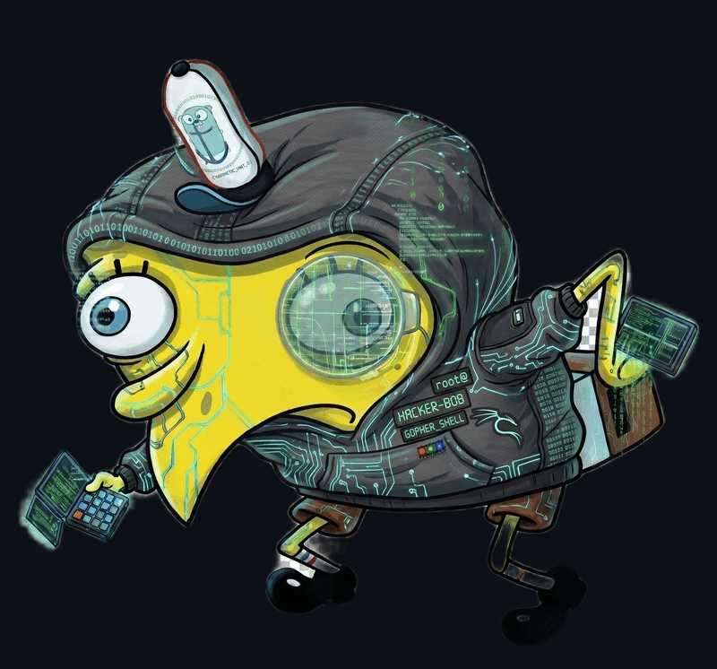

<p align="center">
  
</p>

<h1 align="center">Meet Hacker Bob</h1>

<p align="center"><i>Autonomous bug bounty agent for Claude Code.</i></p>

Bob is an autonomous bug bounty hunting framework for Claude Code. You point him at a domain. He spawns a small army of agents — recon goblins, hunter gremlins, verifiers with trust issues — and they argue with each other until a report falls out.

You go to bed. Bob does not.

## Install

```bash
git clone https://github.com/vmihalis/hacker-bob.git
cd hacker-bob
./install.sh /path/to/your/project
```

The installer drops Bob's brain (agents, `/bob:*` commands, skills, rules, hooks, MCP server) into your project's `.claude/` directory. Run it as many times as you like — it's idempotent and keeps your existing config intact. Bob is polite about other people's settings.

## Usage

```bash
cd /path/to/your/project
claude --dangerously-skip-permissions --effort max
```

Then in Claude Code, summon Bob:

```
/bob:hunt target.com         # full autonomous run
/bob:hunt resume target.com  # pick up where you left off
/bob:status                 # quick latest-session status
/bob:debug                   # review the latest local session
```

That's it. Now go make coffee.

## How Bob hunts

```
RECON → AUTH → HUNT → CHAIN → VERIFY → GRADE → REPORT
```

1. **RECON** — Bob sniffs around. Subdomains, live hosts, archived URLs, nuclei, JS secrets people forgot about.
2. **AUTH** — Bob tries to sign up. If he can, he keeps a victim and an attacker account in his pocket. If he can't, he shrugs and hunts unauthenticated.
3. **HUNT** — Parallel hunter agents fan out, one per attack surface. They are not gentle.
4. **CHAIN** — Bob squints at the findings and asks "wait, can I combine these into something worse?"
5. **VERIFY** — Three rounds of arguing with himself: skeptical Bob, balanced Bob, and final-PoC Bob. Most "bugs" do not survive.
6. **GRADE** — 5-axis scoring. Bob decides: SUBMIT, HOLD, or "this is not a bug, please stop."
7. **REPORT** — A clean, submission-ready writeup with PoCs and evidence. No "could potentially". No "an attacker may". Just receipts.

MCP ranking computes runtime priority for status views and hunter briefs. Imports and public-intel fetches do not rewrite `attack_surface.json`.

## Requirements

- [Claude Code](https://docs.anthropic.com/en/docs/claude-code) with Claude Opus (Bob has expensive taste)
- Node.js 20 or newer
- `curl` and `python3` (already on your machine, probably)
- Optional sidekicks for deeper recon:

```bash
go install github.com/projectdiscovery/subfinder/v2/cmd/subfinder@latest
go install github.com/projectdiscovery/httpx/cmd/httpx@latest
go install github.com/projectdiscovery/nuclei/v3/cmd/nuclei@latest
```

If those aren't installed, Bob just works with what he's got and doesn't complain.

## Development

If you're hacking on Bob himself and want to push the current repo into a test workspace:

```bash
./dev-sync.sh /absolute/path/to/test-workspace
```

It backs up the target's `.mcp.json` and `.claude/settings.json`, runs the installer, recopies the MCP runtime, and smoke-checks with `claude mcp list`. You can find the maintainer workflow in [`CLAUDE.md`](CLAUDE.md).

## A note on scope

Bob will scan whatever you tell him to scan. **You are responsible for making sure the target is in scope and that you have permission.** Bob is enthusiastic, not licensed.

Hunt responsibly. Read the program's policy. Read [`DISCLAIMER.md`](DISCLAIMER.md) before you point him at anything.

## Contributing

Community pull requests are welcome. Read [`CONTRIBUTING.md`](CONTRIBUTING.md) before opening an issue or PR, and report vulnerabilities in Hacker Bob itself through [`SECURITY.md`](SECURITY.md).

## License

Apache License 2.0 — see [`LICENSE`](LICENSE) and [`NOTICE`](NOTICE).
