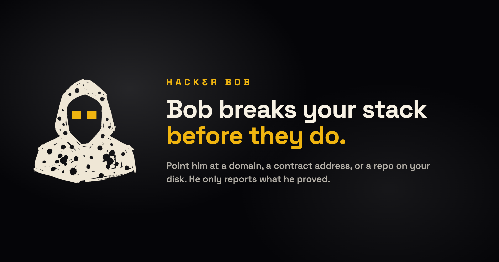
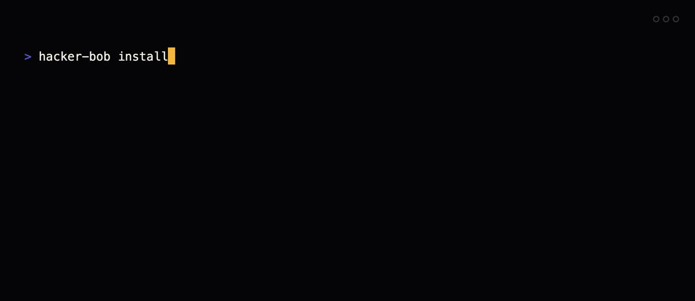
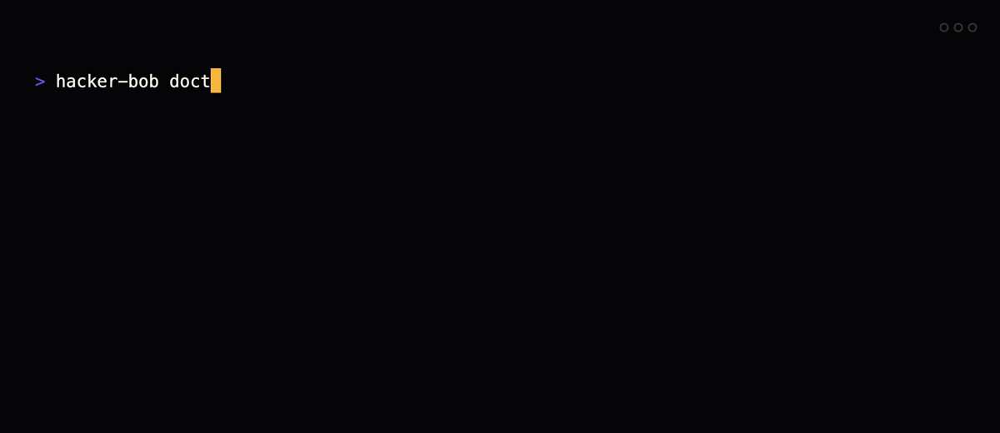
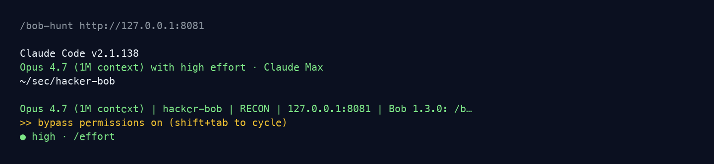
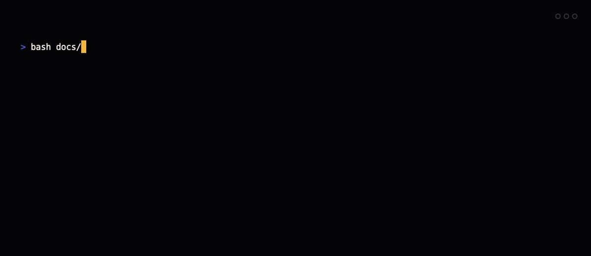
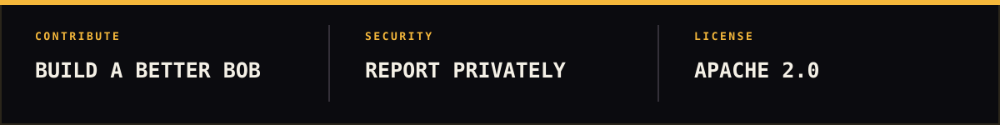

<p align="center">
  <a href="https://hackerbob.ai/">
    
  </a>
</p>

<p align="center">
  <a href="https://github.com/vmihalis/hacker-bob/actions/workflows/ci.yml"></a>
  <a href="https://www.npmjs.com/package/hacker-bob"></a>
  <a href="LICENSE"></a>
  <a href="https://securityscorecards.dev/viewer/?uri=github.com/vmihalis/hacker-bob"></a>
</p>

<p align="center">
  <a href="#01-run-bob"><strong>01 RUN</strong></a> ·
  <a href="#receipt-portfolio"><strong>02 PROOF</strong></a> ·
  <a href="#03-the-evidence-engine"><strong>03 SYSTEM</strong></a> ·
  <a href="#04-ci-diff-review"><strong>04 CI</strong></a> ·
  <a href="#05-safety-boundary"><strong>05 SAFETY</strong></a> ·
  <a href="#06-reference"><strong>06 REFERENCE</strong></a> ·
  <a href="#07-contributing"><strong>07 CONTRIBUTE</strong></a>
</p>

<p align="center">
  <code>LOCAL MCP</code> · <code>AUTHORIZED TARGETS</code> · <code>EVIDENCE BEFORE REPORTING</code>
</p>

<p align="center">
  
</p>

<p align="center">
  
</p>

## 01: Run Bob

Choose the project directory where you want to run Bob. Install into that project, not into this source checkout unless you are developing Bob itself.

### 1. Install

```bash
npx -y hacker-bob@latest install /path/to/your/project
cd /path/to/your/project
```

<p align="center">
  
</p>

The installation animation uses the equivalent global-CLI form against a disposable local workspace and filters the real output to its key milestones. It was generated with [VHS](https://github.com/charmbracelet/vhs) ([view source](docs/media/hacker-bob-demo.tape)).

### 2. Verify the local MCP runtime

```bash
node -e "require('./mcp/server.js'); console.log('MCP ok')"
```

### 3. Restart your host and run Bob

Restart your host CLI from the same project directory, then run the matching command:

| Host | Evaluate | Status | Update | Export |
|---|---|---|---|---|
| Claude Code | `/bob-evaluate target.com` | `/bob-status` | `/bob-update` | `/bob-export` |
| Codex | `$bob-evaluate target.com` | `$bob-status` | `$bob-update` | `$bob-export` |
| Kimi CLI | `/skill:bob-evaluate target.com` | `/skill:bob-status` | `/skill:bob-update` | `/skill:bob-export` |
| Generic MCP host | Connect the generated `.mcp.json`, then follow `.hacker-bob/generic-mcp/hacker-bob.md`. | Use the host's MCP tool interface. | Re-run the shell updater. | Use the host's MCP tool interface. |
| Shell | — | `hacker-bob doctor /path/to/your/project` | `hacker-bob update /path/to/your/project --adapter claude` | — |

<details>
<summary><strong>Watch Bob verify the installation</strong></summary>

Check a local installation and reduce the full doctor report to a quick readiness signal:

```bash
hacker-bob doctor ./project \
  --adapter claude \
  --json \
| jq '{
    ready: .ok,
    host: .adapters[0],
    passed: (
      .checks
      | map(select(.status == "ok"))
      | length
    )
  }'
```

<p align="center">
  
</p>

The doctor demo above was generated with [VHS](https://github.com/charmbracelet/vhs) from a real, isolated Hacker Bob install ([view source](docs/media/hacker-bob-doctor-demo.tape)). It checks only a disposable local workspace—no live target, recon, signup, or scan.

</details>

<details>
<summary><strong>View the individual real terminal captures</strong></summary>

**Evaluation start against a controlled lab target**



**Full installation doctor**


**Fresh-session status**


</details>

<p align="center">
  
</p>

## Receipt portfolio

**17 assigned CVE IDs across nine open-source projects.** This is the exact portfolio currently listed in Hacker Bob's [live receipts](https://hackerbob.ai/#receipts). Fourteen IDs link to a public CVE record or project advisory; the remaining three are identified there as assigned but not public yet.

<p align="center">
  
</p>

The receipt roll mirrors that live portfolio—not simulated scan output. Red provides visual emphasis; it does not assert CVSS severity. Generated with [VHS](https://github.com/charmbracelet/vhs) from a checked-in [tape](docs/media/hacker-bob-receipts-demo.tape) and [receipt source](docs/media/hacker-bob-receipts-demo.sh).

<details>
<summary><strong>Read the CVE receipt list</strong></summary>

| Project | CVE IDs | Public source status |
|---|---|---|
| `stable-diffusion.cpp` | [`CVE-2026-47747`](https://www.cve.org/CVERecord?id=CVE-2026-47747), [`CVE-2026-47748`](https://www.cve.org/CVERecord?id=CVE-2026-47748), [`CVE-2026-47749`](https://www.cve.org/CVERecord?id=CVE-2026-47749), [`CVE-2026-47750`](https://www.cve.org/CVERecord?id=CVE-2026-47750) | Published CVE records |
| `netatalk` | [`CVE-2026-49387`](https://netatalk.io/security/CVE-2026-49387.html), [`CVE-2026-49388`](https://netatalk.io/security/CVE-2026-49388.html), [`CVE-2026-49389`](https://netatalk.io/security/CVE-2026-49389.html), [`CVE-2026-49390`](https://netatalk.io/security/CVE-2026-49390.html) | Published project advisories |
| `libcupsfilters` | [`CVE-2026-64611`](https://www.cve.org/CVERecord?id=CVE-2026-64611), [`CVE-2026-64612`](https://www.cve.org/CVERecord?id=CVE-2026-64612) | Published CVE records |
| `libtirpc` | `CVE-2026-66714`, `CVE-2026-66715` | Assigned; public records pending |
| `OpenSSH` | [`CVE-2026-35388`](https://www.cve.org/CVERecord?id=CVE-2026-35388) | Published CVE record |
| `libheif` | [`CVE-2026-49271`](https://www.cve.org/CVERecord?id=CVE-2026-49271) | Published CVE record |
| `Samba` | [`CVE-2026-3012`](https://www.cve.org/CVERecord?id=CVE-2026-3012) | Published CVE record |
| `rpcbind` | [`CVE-2026-16277`](https://www.cve.org/CVERecord?id=CVE-2026-16277) | Published CVE record |
| `OpenEXR` | `CVE-2026-65979` | Assigned; public record pending |

</details>

## 03: The evidence engine

Hacker Bob installs a local MCP runtime into a project directory and connects it to Claude Code, Codex, Kimi CLI, or another MCP-capable host. The runtime coordinates surface mapping, authentication setup, parallel surface testing, finding verification, grading, reporting, and local evidence handling.

### Discover. Test. Prove.

| Discover | Test | Prove |
|---|---|---|
| Maps subdomains, live hosts, archives, crawled URLs, JavaScript hints, and repository surfaces. | Establishes authorized auth profiles and runs parallel evaluators against prioritized attack surfaces. | Independently verifies findings, collects bounded evidence, grades impact, and produces submission-ready reports. |
| Imports local artifacts and optional public-intelligence leads without rewriting the canonical attack surface. | Evaluates whether isolated findings combine into higher-impact chains. | Keeps run state, telemetry, reports, and evidence local under a session-owned root. |

Bob can evaluate staging or authorized live applications, checked-out open-source repositories, smart-contract surfaces, and pull-request diffs in CI.

### Seven stages. One evidence chain.

Bob follows a structured workflow:


```mermaid
flowchart LR
    SD["SURFACE<br/>DISCOVERY"] --> AU["AUTH"]
    AU --> EV["EVALUATE"]
    EV --> CH["CHAIN"]
    CH --> VE["VERIFY"]
    VE --> GR["GRADE"]
    GR --> RE["REPORT"]
    classDef stage fill:#111116,stroke:#F5B83B,color:#F4F0E6,stroke-width:2px
    classDef report fill:#F5B83B,stroke:#F5B83B,color:#050508,stroke-width:2px
    class SD,AU,EV,CH,VE,GR stage
    class RE report
    linkStyle default stroke:#F5B83B,stroke-width:2px
```

- `SURFACE_DISCOVERY`: Collects subdomains, live hosts, archived URLs, crawled URLs, nuclei signals, JavaScript hints, and optional deep-surface-discovery lead data.
- `AUTH`: Attempts authorized account setup when possible and records usable profiles for later differential testing.
- `EVALUATE`: Starts parallel evaluators against runtime-prioritized attack surfaces.
- `CHAIN`: Evaluates whether individual findings combine into higher-impact scenarios.
- `VERIFY`: Runs independent verification passes and collects bounded evidence for surviving reportable findings.
- `GRADE`: Scores confirmed findings and decides whether they are ready to submit, should be held, or should be discarded.
- `REPORT`: Produces a clean report with verified proof and evidence references.

MCP ranking computes runtime priority for status views and evaluator briefs. Imports and public-intel fetches do not rewrite `attack_surface.json`.

### Supported surfaces

| Surface | How Bob approaches it |
|---|---|
| **Web applications and APIs** | Surface discovery, authorized account setup, first-party target-host requests, browser-assisted flows, parallel evaluation, and independent verification. |
| **Smart contracts** | Public HTTPS RPC/REST ladders and preflighted endpoints, with dedicated fork runners for Foundry, Anchor, Aptos, Sui, Substrate, CosmWasm, and Halmos workflows. |
| **Open-source repositories** | Repository inventory, session-scoped Docker plans, read-only repo mounts by default, and a dedicated native C/C++ parser, protocol, and memory-safety surface. |
| **Pull-request diffs** | Headless GitHub Actions review with inline findings, a Check Run summary, and a full report artifact. |

### OSS project review mode

Local open-source project review runs against a checked-out repository instead of a live target domain. It inventories repo files, writes a session-scoped Docker plan, and keeps dependency installs and build repros inside a Docker image when explicitly requested. Docker command replay mounts the repo read-only by default and uses a session-owned writable work directory. Native C/C++ projects get a dedicated parser/protocol/memory-safety surface so evaluators bias toward reachable file/function evidence instead of generic repo audit notes. OSS mode is plumbed through the same v2 governance/frontier/scheduler/claim planes and is exposed as a forward-ported entry point (`/bob-evaluate <repo-path>` semantics) under the unified lifecycle FSM.

### Local multi-session dashboard

For a local read-only dashboard over multiple concurrent sessions:

```bash
hacker-bob dashboard --repo-only
```

The dashboard binds to `127.0.0.1:4873` by default and reads `~/hacker-bob-sessions`. It shows OSS/repo progress, pending handoffs, claims, verification/evidence/grade state, and cross-session bottlenecks.

<p align="center">
  
</p>

## 04: CI diff review

Bob can review pull request diffs automatically using GitHub Actions. The
review runs headless inside GitHub-hosted runners and posts inline comments
plus a Check Run result on every PR.

### Quick setup

1. **Set org-level secrets and variables** once in your GitHub organization
   (Settings > Secrets and variables > Actions):

   | Name | Type | Description |
   |---|---|---|
   | `ANTHROPIC_OAUTH_TOKEN` | Secret | Recommended Anthropic OAuth token from `claude setup-token` for the headless Claude reviewer. |
   | `ANTHROPIC_API_KEY` | Secret | Anthropic API key fallback for the headless Claude reviewer. Required only when `ANTHROPIC_OAUTH_TOKEN` is not set. |
   | `BOB_INSTALL_TOKEN` | Secret | GitHub App token or fine-grained PAT with `read:packages` and `contents:read` scopes. Used to install `@bobnetsec/*` packages. |
   | `BOB_VERSION` | Variable | Bob release tag to cache, e.g. `v1.2.3`. Shared across repos in the org so they reuse the same warm workspace cache. |

2. **Add the caller workflow** to each repository you want reviewed. Create
   `.github/workflows/bob-review.yml` with the minimal content below:

   ```yaml
   name: Bob Diff Review

   on:
     pull_request:
       types: [opened, synchronize, reopened]

   permissions:
     pull-requests: write
     checks: write
     contents: read

   jobs:
     bob-review:
       uses: bobnetsec/bob-workflows/.github/workflows/bob-review.yml@v1
       secrets: inherit
   ```

   That is the complete file. `secrets: inherit` propagates the org-level
   secrets automatically — no per-repo secret declarations required.

<details>
<summary><strong>Optional inputs, findings, fork PRs, and versioning</strong></summary>

### Optional inputs

Pass these under `with:` on the `bob-review` job if you need to override the
reusable workflow defaults:

| Input | Default | Description |
|---|---|---|
| `min-severity-for-failure` | `high` | Minimum severity that sets the PR check to failed. Accepts `critical`, `high`, `medium`, or `low`. Set to `critical` to fail only on critical findings; set to `low` to fail on any finding. |

Example with `min-severity-for-failure` overridden:

```yaml
jobs:
  bob-review:
    uses: bobnetsec/bob-workflows/.github/workflows/bob-review.yml@v1
    secrets: inherit
    with:
      min-severity-for-failure: critical
      bob-workflows-ref: v1
```

### Viewing findings

- **Inline PR comments**: Bob posts a comment on each changed line that
  contains a finding. Comments include severity, a short description, and a
  suggested fix when available.
- **Check Run**: A "Bob Diff Review" check appears in the PR Checks tab. The
  summary shows `findings_count`, `critical_count`, and links to the full
  report artifact.
- **Actions log**: The "Log review outputs" step in the run log prints
  `findings_count`, `critical_count`, and `review_url` for quick triage.

### Fork PRs

Forked PRs do not receive org-level secrets, and same-repo PRs may also run
before reviewer credentials are configured. The workflow detects missing
Anthropic credentials and skips the Bob review steps instead of failing the PR
check in setup. No additional guard is needed in the caller workflow.

### Versioning

Pin the reusable workflow to a release tag or full commit SHA. If you override
`bob-workflows-ref`, set it to the same immutable ref so the workflow checks out
the matching local action source:

```yaml
uses: bobnetsec/bob-workflows/.github/workflows/bob-review.yml@v1
```

</details>

## 05: Safety boundary

> [!WARNING]
> Only run Bob against targets, accounts, applications, APIs, and infrastructure you own or are explicitly authorized to test. Bob does not prove authorization, enforce a program policy, guarantee containment, or control arbitrary host shell commands and unrelated browser activity.

Bob runs offensive security on surfaces you control—your own code in CI, your staging environments, and authorized live targets. It can send real network requests, run local surface-discovery tools, import local artifacts, and preserve sensitive run data on disk. You are responsible for using it only where you have permission.

<details>
<summary><strong>Full authorization, egress, browser, and smart-contract networking model</strong></summary>

Only run Bob against targets, accounts, applications, APIs, and infrastructure you own or are explicitly authorized to test. Read the scope and rules of engagement before starting an evaluation.

Bob does not prove authorization, enforce a program policy, or guarantee containment. For session-bound MCP tools, caller `target_domain` is only a lookup key: Bob authorizes against initialized session state, validates the stored `target` and `target_url`, and rejects drift before handlers run. Bob's MCP-scoped HTTP tools additionally require a public `target_domain` and only send first-party target-host requests; browser auto-signup routes page HTTP requests through a target-host guard but refuses effective `block_internal_hosts: true` because Chromium resolves network destinations outside Bob's safeFetch transport. Bob does not control arbitrary host shell commands, unrelated browser activity, or external surface-discovery binaries. By default, `normal`, `yolo`, and compatible legacy sessions allow public first-party hostnames that resolve to private infrastructure; `paranoid` sessions default to direct-egress DNS/private-address blocking unless the operator starts the session with `--allow-internal-hosts` for an explicitly authorized internal/lab program. First-party host scope is not DNS-rebinding or SSRF protection. Bob uses the packaged Public Suffix List via `psl` to reject public-suffix-only `target_domain` values and isolate registrable tenant domains. If that packaged list is stale, an operator can set `BOB_PSL_OVERLAY_FILE` to a local suffix file before running Bob; overlay matches are recorded in HTTP audit rows with `public_suffix_source` and `psl_overlay_file`, and the overlay is not a per-request bypass. For tools that support it, pass `--block-internal-hosts` or `block_internal_hosts: true` when you need local DNS/private-address blocking outside paranoid mode. The effective value is persisted in state and HTTP audit rows. That stricter mode is only available on direct egress, not proxy-backed egress profiles where target DNS and routing happen outside Bob.

Bob binds the selected `egress_profile` to the session at `bob_init_session` and records a redacted `egress_profile_identity_hash` in state, HTTP audit, evaluator briefs, signup responses, pipeline events, and analytics. Egress-bound HTTP and signup tools require initialized session state; legacy sessions may default presentation/progress fields, but missing or drifted authority fields such as `target`, `target_url`, internal-host policy, or egress identity fail closed for tools that rely on them. Bob hashes the profile name, region, proxy-configured bit, proxy route, and env/source identity, excluding raw credentials and description text; credential rotation on the same proxy route is allowed, but profile, route, or source drift fails closed.

Smart-contract RPC/REST tools use a separate direct-only model: shipped public ladders, explicit `endpoints` / `fork_urls`, and `BOB_<FAMILY>_RPCS_<NETWORK>` env overrides must be public HTTPS endpoints. Bob filters localhost/private/internal literals and performs bounded DNS private-address preflight for SC endpoints. Bob-owned Node SC reads and EVM source fetches then pin the HTTPS socket lookup to one of those preflighted public DNS answers. Fork runners are different: Foundry, Anchor, Aptos, Sui, Substrate, CosmWasm, and Halmos subprocesses run with proxy/RPC/secret env scrubbed, then receive only runner-created fork URL env or CLI args that came from preflighted public endpoints; Bob does not control or DNS-pin the downstream CLI socket. SC RPC does not use `egress_profile` proxy routing, and private/localnet RPC is unsupported by default until a per-family opt-in policy exists. Returned endpoint evidence and policy rejections redact credentials and query values.

If your Claude Code workflow uses `--dangerously-skip-permissions`, use it only in a dedicated workspace for authorized security testing.

</details>

<details>
<summary><strong>Session roots, concurrent engines, proxy handling, and stored data</strong></summary>

### Data and security model

Bob stores local run state, telemetry, and evidence under a session root that all reads and writes resolve to. The pre-v2.0 `~/bounty-agent-sessions/` root is no longer auto-resolved or auto-copied; remove a leftover legacy root with `hacker-bob install --purge-legacy-session-root` (dry-run by default, `--yes` to delete). Treat these directories as sensitive. They can contain target names, request metadata, notes, credentials metadata, and report evidence from authorized testing.

### Session roots and concurrent engines

Bob elects exactly one engine per session root, so two workspaces can only run engines at the same time if their session roots are **disjoint** — an engine sharing another engine's session state would enforce gates against state a second process is already moving. The installer therefore gives each workspace its own root, `~/hacker-bob-sessions-<workspace>-<hash>`, derived from the workspace path (stable across re-installs) and written as `BOB_SESSIONS_ROOT` into that workspace's `.mcp.json` server env and `.claude/settings.json` env. That is **operator configuration**: the engine reads it once at boot and freezes it, and no agent or MCP tool can change it — edit it yourself if you want a different root, keeping it absolute, private to your user, and never nested inside another root. A workspace that was already installed and still has sessions in the shared `~/hacker-bob-sessions/` keeps using it (nothing is orphaned); to move it onto its own root, run `mv ~/hacker-bob-sessions/<target-domain> ~/hacker-bob-sessions-<workspace>-<hash>/` — the installer prints the exact path — and re-run the installer. The standalone `hacker-bob dashboard` CLI reads whatever `BOB_SESSIONS_ROOT` its own shell exports (it is not tied to a workspace), so point it at one root explicitly: `BOB_SESSIONS_ROOT=~/hacker-bob-sessions-<workspace>-<hash> hacker-bob dashboard`. **Operator caution:** disjoint roots make concurrent engines safe, they do not make concurrent evaluations of the SAME target safe. Rate limits, circuit breakers, and request budgets are per-engine, so two engines hunting one target from two roots double the request volume that target sees and neither one knows it. Hunt different targets.

During an evaluation, Bob may make outbound HTTP requests, run local surface-discovery tools, import HTTP or static artifacts, and use host-side reasoning over the collected context. Optional third-party services and dependencies, such as browser automation dependencies, CAPTCHA solving, public-intel sources, or external surface-discovery tools, are used only when you configure the relevant dependencies or credentials.

The npm packages are published through the project release workflow with npm provenance. `hacker-bob` is the canonical package; `hacker-bob-cc`, `hacker-bob-codex`, and `hacker-bob-kimi` are small wrapper packages that depend on the matching canonical version.

Read [DISCLAIMER.md](DISCLAIMER.md) before using Bob on any target.

</details>

## 06: Reference

Dense operational details stay here—complete, searchable, and out of the quick path.

<details>
<summary><strong>Installation, adapters, migrations, and installed files</strong></summary>

### Installation

`hacker-bob` is the canonical npm package:

```bash
npx -y hacker-bob@latest install /path/to/your/project
```

Adapter-specific installs are available when you want to choose the host explicitly:

```bash
npx -y hacker-bob@latest install /path/to/your/project --adapter claude
npx -y hacker-bob@latest install /path/to/your/project --adapter codex
npx -y hacker-bob@latest install /path/to/your/project --adapter generic-mcp
npx -y hacker-bob@latest install /path/to/your/project --adapter kimi
npx -y hacker-bob@latest install /path/to/your/project --adapter all
```

The installer is idempotent and preserves unrelated host configuration. It writes the shared MCP runtime to `mcp/`, neutral Bob resources to `.hacker-bob/`, and adapter-specific files for the selected host.

Underneath that narrative, the engine drives a strict six-state lifecycle FSM (`SETUP -> OPEN_FRONTIER -> CLAIM_FREEZE -> VERIFY -> GRADE -> REPORT`, with defined back-edges so an operator can re-enter `OPEN_FRONTIER` from any later state). The persisted `SessionNucleus` (`session-nucleus.json`) is the sole authority for a session's identity, scope, and lifecycle state; `state.json` is a grant-free READ PROJECTION derived from it, never a second write path; and `session-events.jsonl` is provenance/audit only. A session that predates (or somehow lost) its nucleus gains one exactly once through `migrateLegacySessionAuthority`, and its legacy projection stays readable but grant-free until that migration runs. `bob_read_session_nucleus` and `bob_read_session_summary` both surface a `verified` boolean alongside the nucleus so callers can distinguish a cryptographically verified nucleus from an unverified state-derived fallback.

### OSS Project Review Mode

| Adapter | Installed files |
|---|---|
| `claude` | `.claude/` commands, skills, agents, hooks, statusline setup, and MCP settings. |
| `codex` | `$bob-*` skills in `~/.codex/skills`, a local `.codex/plugins/hacker-bob` plugin, `.agents/plugins/marketplace.json`, and Codex MCP activation metadata. |
| `kimi` | `.kimi/skills`, `.kimi/mcp.json`, and `.kimi/bob` compatibility metadata. Installs PreToolUse session-guard hooks registered in `~/.kimi/config.toml`. |
| `generic-mcp` | A root `.mcp.json` entry plus prompt guide files under `.hacker-bob/generic-mcp/`. |

When `--adapter` is omitted, Bob chooses an adapter from prior install metadata, host environment markers, project files, and installed host CLIs. Claude is the final fallback.

The MCP server name is `hacker-bob`. You will see `hacker-bob` in `.mcp.json`, in `claude mcp list`, and as the prefix on tool names such as `mcp__hacker-bob__bob_*`. Existing v1.x installs are auto-migrated on the next install or update: the legacy `bountyagent` server key and `mcp__bountyagent__*` permission strings are rewritten to the canonical `hacker-bob` form while operator-managed sibling servers and custom permissions are preserved.

Host-specific wrappers—[`hacker-bob-cc`](https://www.npmjs.com/package/hacker-bob-cc), [`hacker-bob-codex`](https://www.npmjs.com/package/hacker-bob-codex), and [`hacker-bob-kimi`](https://www.npmjs.com/package/hacker-bob-kimi)—are available when you want the host choice encoded in the package name:

```bash
npx -y hacker-bob-cc@latest install /path/to/your/project
npx -y hacker-bob-codex@latest install /path/to/your/project
npx -y hacker-bob-kimi@latest install /path/to/your/project
```

You can also install the CLI globally:

```bash
npm install -g hacker-bob
hacker-bob install /path/to/your/project --adapter claude
```

A global install only adds the `hacker-bob` command to your `PATH`; it does not install Bob into every project automatically.

Source installs are for contributors and local development:

```bash
git clone https://github.com/vmihalis/hacker-bob.git
cd hacker-bob
./install.sh /path/to/your/project
```

</details>

<details>
<summary><strong>Complete host command reference</strong></summary>

### Commands

Claude Code commands:

```text
/bob-evaluate target.com         # start a normal evaluate
/bob-evaluate target.com --deep  # broader surface-discovery and deep lead follow-up
/bob-evaluate resume target.com  # resume an existing session
/bob-status                  # show latest session status
/bob-debug                   # inspect the latest local run
/bob-update                  # preview and install the latest release
/bob-export                  # create a release-scoped improvement bundle
/bob-egress                  # manage operator-controlled egress profiles
```

Codex uses the same command names with a `$` prefix:

```text
$bob-evaluate target.com
$bob-status
$bob-debug
$bob-update
$bob-export
$bob-egress
```

Kimi CLI uses a `/skill:` prefix:

```text
/skill:bob-evaluate target.com
/skill:bob-status
/skill:bob-debug
/skill:bob-update
/skill:bob-export
/skill:bob-egress
```

For install diagnostics:

```bash
hacker-bob doctor /path/to/your/project
hacker-bob doctor /path/to/your/project --adapter codex
hacker-bob doctor /path/to/your/project --adapter kimi
```

</details>

<details>
<summary><strong>Requirements and optional surface-discovery tools</strong></summary>

### Requirements

- Node.js 20 or newer
- One supported host: Claude Code, Codex, Kimi CLI, or another MCP-capable host
- `curl` and `python3`
- A dedicated project directory for the installed runtime

Optional surface-discovery tools improve coverage when they are installed:

```bash
go install github.com/projectdiscovery/subfinder/v2/cmd/subfinder@latest
go install github.com/projectdiscovery/httpx/cmd/httpx@latest
go install github.com/projectdiscovery/nuclei/v3/cmd/nuclei@latest
go install github.com/owasp-amass/amass/v4/...@latest
go install github.com/tomnomnom/assetfinder@latest
go install github.com/projectdiscovery/chaos-client/cmd/chaos@latest
go install -v github.com/projectdiscovery/dnsx/cmd/dnsx@latest
go install github.com/projectdiscovery/tlsx/cmd/tlsx@latest
go install github.com/projectdiscovery/katana/cmd/katana@latest
go install -v github.com/PentestPad/subzy@latest
git clone https://github.com/ticarpi/jwt_tool ~/jwt_tool
python3 -m pip install -r ~/jwt_tool/requirements.txt
```

Bob still runs without the optional tools; the installed toolset determines which surface-discovery paths are available.

</details>

<details>
<summary><strong>Updating Hacker Bob</strong></summary>

### Updates

From Claude Code:

```text
/bob-update
```

From Codex:

```text
$bob-update
```

From Kimi:

```text
/skill:bob-update
```

From a shell:

```bash
hacker-bob update /path/to/your/project --adapter claude
```

After an update, fully restart your host CLI in the project directory so it reloads commands, MCP config, hooks, and skills.

Bob also checks for available updates once per day on session start and stores the result under `~/.cache/hacker-bob/update-checks/`. Status views read that local cache.

</details>

<details>
<summary><strong>Exporting run data</strong></summary>

### Exporting run data

After testing with an installed release, run `/bob-export` in Claude, `$bob-export` in Codex, or `/skill:bob-export` in Kimi. Bob writes a timestamped bundle under:

```text
~/bounty-agent-telemetry/release-bundles/v<version>/
```

The bundle includes summaries, filtered telemetry, session references, and a handoff document for improving future releases. Export is read-only and does not touch targets.

</details>

<details>
<summary><strong>Troubleshooting and detailed guides</strong></summary>

### Troubleshooting

Use the doctor command first:

```bash
hacker-bob doctor /path/to/your/project --adapter all
```

Common checks:

- `node -e "require('./mcp/server.js'); console.log('MCP ok')"` should pass from the installed project.
- Claude Code must be restarted after install or update before `/bob-*` commands and MCP settings load.
- Codex must be restarted after install or update before `$bob-*` skills and local plugin wiring load.
- Kimi CLI must be restarted after install or update before `/skill:bob-*` skills and MCP config load.
- `.mcp.json` should contain an `mcpServers["hacker-bob"]` entry pointing at the installed project's `mcp/server.js`. v1.x installs are auto-migrated to this canonical key on next install or update.
- If an upgrade leaves `mcp/tools/` missing, rerun the installer with `hacker-bob@latest`.

Detailed guides:

- [First Run](docs/FIRST_RUN.md)
- [Troubleshooting](docs/TROUBLESHOOTING.md)
- [Adapters](docs/ADAPTERS.md)
- [Package surfaces](docs/PACKAGE_SURFACES.md)
- [Roadmap](docs/ROADMAP.md)

</details>

<details>
<summary><strong>Developing Hacker Bob locally</strong></summary>

### Development

For local development on Bob itself:

```bash
npm test
npm run test:native-darwin # Darwin arm64 + Node.js 20 qualification
npm run release:check
npm run release:check:dependencies
```

To push the current checkout into a separate test workspace:

```bash
./dev-sync.sh /absolute/path/to/test-workspace
./dev-sync.sh /absolute/path/to/test-workspace --adapter codex
./dev-sync.sh /absolute/path/to/test-workspace --adapter kimi
```

The maintainer workflow is documented in [CLAUDE.md](CLAUDE.md).

</details>

## 07: Contributing

<p align="center">
  
</p>

| Contribute | Report securely | Reuse |
|---|---|---|
| Pull requests are welcome. Read **[CONTRIBUTING.md](CONTRIBUTING.md)** before opening an issue or PR. | Report vulnerabilities in Hacker Bob itself through the private flow in **[SECURITY.md](SECURITY.md)**. Do not open a public issue or discussion. | Hacker Bob is licensed under the **[Apache License 2.0](LICENSE)**. See [NOTICE](NOTICE). |
