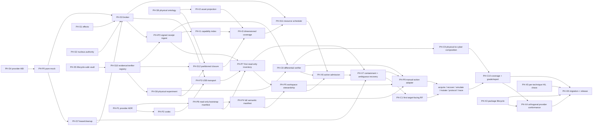

# Plane-PH — General Physical-Security Task Hypergraph

Status: **v0.3 proposed; implementation ledger reconciled 2026-07-20**

Date: 2026-07-20

Branch: `feat/chameleon-ultra`

## Thesis

Physical pentesting becomes a first-class Bob plane when the runtime can:

1. bind authorized physical assets and permitted external effects;
2. control an instrument without giving the agent a raw hardware channel;
3. map provider operations into reusable pentest techniques;
4. record a physical stimulus and observations from independent sources;
5. prove an outcome with a differential control; and
6. compose the proven physical transition into Bob's existing attack graph.

The Chameleon Ultra is the first provider and the first full hardware-in-loop
acceptance target. It does not define the core vocabulary. The resulting plane
must also admit future Proxmark, smart-card, BLE, SDR, Wi-Fi, USB, GPIO, and
other physical-security instruments without changing the authority, evidence,
or finding contracts.

## Current implementation ledger

This ledger is the package-safe repository projection, not production or HIL
evidence. Signed gate and review evidence belongs in Bob-owned runtime state and
must never be replaced with a review-document path or file hash. Consequently,
`done` still means verified closure, not merely that code and tests exist.

| Dimension | Current state |
| --- | --- |
| Node readiness | 48 total: 5 root nodes `in_review`, 43 dependency-blocked, 0 `done` |
| Source engineering gates | 7 `failed`, 41 `pending`, 0 `passed` |
| Implementation audit | 38 gates are candidate-complete from code and focused tests; 10 still need engineering work (`PH-S3`, `PH-S7`, `PH-S11`, `PH-I1`, `PH-P6`, `PH-C9`, `PH-X3`, `PH-X4`, `PH-X7`, `PH-X8`) |
| Current machine findings | 13 blockers assigned once to 5 owning nodes |
| Production-nonwaivable HIL | 22 `pending`, 0 passed, 0 waived |
| Evidence refs in package JSON | 0 engineering, 0 review, 0 HIL, by design |
| Hyperedges | Unchanged: 41 blocking edges remain the authoritative dependency topology |

The five contract roots now read `in_review`: `PH-S1`, `PH-S2`, `PH-S4`,
`PH-S5`, and `PH-S8`. This records active engineering review without claiming
gate acceptance. Non-root nodes remain `blocked` until their predecessors close
with real evidence.

The current production blocker ownership is:

| Owner | Open findings |
| --- | --- |
| `PH-S3` | `provider_worker_vault_dispatch_transaction_owner_missing`; `qualified_native_effect_owner_missing` |
| `PH-S7` | `external_anchor_implementation_attestation_missing`; `external_linearizable_transaction_ledger_missing`; `worst_case_post_arm_capacity_reservation_missing` |
| `PH-IP3` | `authenticated_native_terminal_origin_missing`; `durable_terminal_outbox_custodian_missing`; `provider_worker_vault_terminal_projection_owner_missing` |
| `PH-X6` | `complete_authority_to_native_binding_missing` |
| `PH-X7` | `independent_restoration_custodian_missing`; `native_commit_go_attestation_missing`; `native_effect_arm_attestation_missing`; `trusted_monotonic_deadline_preemption_missing` |

The former `PH-X8` gate-evidence reference-schema-mismatch blocker is
resolved in code and cleared from the ledger. The package graph checker
(`scripts/check-plane-physical.js`) requires the single production
`bob-evidence:sha256:` scheme for graph-tracked engineering, HIL, and review
evidence — the same scheme the runtime gate issuer emits and
`plane-physical-release-readiness.js` accepts — so the graph can carry
production-qualified references without failing the checker, and the package
scrubber redacts that scheme from published text. There is one unversioned wire
scheme; conformance-versus-production is carried by the signed evidence's
`assurance` / `production_ready` fields, not by a version token, and any
versioned reference is rejected as an invalid evidence ref. `PH-X8` still reads
`engineering_state: failed`: its full gate additionally requires the release
command to consume the signed readiness evaluator with
candidate/evidence/basis idempotency, and its HIL gate remains non-waivable. The
schema fix removes an artificial deadlock; it does not by itself unblock release.

The former `PH-X3` `provider_neutral_runtime_store_package_boundary_missing`
blocker is earned and cleared. The provider-neutral broker and artifact-vault
packages no longer host, require, or export any Chameleon-specific code: the
RF-off executor, completion-evidence adapter, and vault semantic validators
moved into the `bob-instrument-chameleon` package, and the MCP composition root
now selects provider code by data through a signed immutable provider-profile
catalog (`packages/bob-instrument-contracts/lib/provider-profile-catalog.js`)
whose profiles carry only scalar ids and reviewed-evidence digests — never a
callback, module path, signer, or parser — and whose selection path requires
signature verification. The boundary is enforced mechanically by
`test/physical-provider-neutral-boundary.test.js` (a static source lock), so the
frozen blocker was removed only after the boundary became real, not before.
`PH-X3` still reads `engineering_state: failed` pending its broader packaging and
conformance gate; the boundary finding is closed, the node is not.

The focused durable-store and transaction-owner checks are green (`69/69` and
`23/23` respectively), as are the physical package and installer checks
(`27/27` and `75/75`). These results justify candidate engineering progress but
do not populate signed gate slots. A broad MCP run that overlapped live edits is
explicitly excluded from this ledger.

The gate-evidence tracking is now aligned. The next useful cut is therefore
narrow: wire `scripts/release-check.js` to the signed readiness evaluator with
candidate/evidence/basis idempotency, close the single provider/worker/vault
transaction lineage through authenticated native terminal publication and
independent restoration, then run the first authorized RF-off Chameleon
bootstrap HIL. Additional durability or concurrency work is added only when that
vertical slice demonstrates the need.

Adversarial context and dispositions remain in the dated
[Brutalist reviews](reviews/); those documents are review input and engineering
history, not signed gate evidence.

## The five layers that must not collapse

| Layer | Owns | Does not own |
| --- | --- | --- |
| Provider | Transport, framing, command correlation, device workspaces, state restoration | Pentest hypotheses, target scope, findings |
| Normalized operation | Instrument semantics such as `inventory`, `discover`, `transceive`, `capture`, `read`, `stage`, `present`, and `write` | Device command names, security hypotheses, and engagement policy |
| Technique | A security hypothesis plus applicability and controls | Raw ports, raw secrets, finding disposition |
| Experiment | One scoped stimulus, observations, controls, and artifact references | Severity or report prose |
| Verifier | Differential adjudication, provenance validation, and replay | Provider implementation details |

A provider reporting support for an operation only makes a technique
*possible*. Applicability also requires target technology, authority, required
artifacts, observer availability, and a satisfiable control.

## Effects, outcomes, and data

The existing `mutating`, `network_access`, and `browser_access` booleans remain
compatibility projections; they are not an authorization model for physical
work. A flat RFID-specific enum would also fail as soon as a provider uses
contact, USB, BLE, SDR, GPIO, optical, acoustic, or actuator channels.

Provider manifests therefore declare maximum **effect templates**. Every
execution binds the exact effects it requests before dispatch:

```text
requested_effect {
  template_id
  subject_kind: instrument | target | environment
  subject_ref
  action: observe | configure | transmit | present | mutate |
          actuate | administer | destroy
  channel: instrument_local | rf | contact | usb | ble | network |
           gpio | optical | acoustic | manual | other
  persistence: none | ephemeral | persistent | irreversible
  bounds {
    duration_ms? attempt_limit? byte_limit? frequency_band? power_ceiling?
    duty_cycle? zone_ref? containment_plan_ref? execution_deadline?
    state_delta_plan_ref? cleanup_plan_digest? residual_state_plan_ref?
    auth_attempt_limit? counter_delta_limit? lockout_headroom_ref?
    log_event_limit? terminal_state_plan_ref?
    spatial_envelope_ref? stimulus_sequence_ref?
    pre_state_snapshot_ref? backup_artifact_ref? expected_terminal_state_ref?
    post_operation_inventory_plan_ref? assurance_invalidation_plan_ref?
    recovery_or_quarantine_plan_ref? owned_fixture_ref? hil_evidence_plan_ref?
    physical_quantity_bounds[]? {
      quantity_id, canonical_unit, min?, max?, rate_limit?,
      uncertainty?, measurement_method_ref
    }
  }
}
```

Physical quantities come from a versioned, unit-aware registry rather than new
core fields per provider. Initial families cover voltage/current/logical level,
power/energy, frequency/bandwidth/gain/sample rate, optical intensity, acoustic
level, temperature, force/travel, distance/orientation, and measurement
uncertainty. A provider extension must register quantity semantics, canonical
units, conversion rules, safe ranges, and evidence requirements before a grant
can carry it. RF effects always bind a spatial envelope and a canonical stimulus
sequence; a single transmission is represented as a one-step sequence.

The operation manifest limits which templates and bounds may be requested; the
technique selects an exact subset; and the existing registry and authority layer
projects legacy booleans into an **unsigned** normalized execution request. A
privilege-separated policy issuer revalidates that request against the current
hash-bound session nucleus and mints the one-use execution grant; a distinct
device worker rechecks it. Roadmap nodes use `effect_surface[]` only as
non-authorizing risk metadata. This prevents a technique family from receiving
write authority just because one optional variant can write.

An observation or verified result is not an executable effect. Outcomes live in
a separate closed registry such as `credential.accepted`,
`physical.transition`, `control.state_changed`, `alarm.state_changed`, and
`reachability.changed`. Only a verifier can assert an outcome; an instrument
receipt can only prove the stimulus.

Sensitive outputs use opaque artifact references and one of four data classes:

- `metadata` — model, firmware, normalized capability IDs;
- `linkable` — UIDs, facility/card numbers, traces, APDU metadata;
- `credential_secret` — dumps, keys, nonces, passwords, emulator images;
- `regulated` — payment or identity data, access logs, imagery.

`linkable` and above never enter prompts or ordinary telemetry. Public tool
results contain masked summaries and random, unguessable, session-scoped
handles. Plain content hashes are not handles: low-entropy identifiers can be
guessed and stable digests correlate engagements. Content digests remain
vault-internal; comparisons expose only engagement-keyed HMACs. Randomized AEAD,
vault-secret keyed comparison tokens, and key separation are mandatory for
`credential_secret` and `regulated` data so captured ciphertext or a public
handle does not create a low-entropy offline guessing oracle. Secret-consuming
recovery, decode, compare, and transform jobs execute inside an allowlisted
vault worker: they accept opaque input handles and emit new handles, bounded
summaries, and tool/version provenance—never secret bytes to the agent. Raw
export is a separate operator-authenticated channel, not an MCP resolution path.

The vault reserves quota before stimulus so disk-full cannot strand an effect
without its evidence sink. Retention, expiry, audited deletion, cryptographic
erasure, reference-aware garbage collection, corruption quarantine, backup, and
recovery are versioned lifecycle operations. Evidence handles remain bound to
session nucleus, task/attempt, data class, and integrity metadata; live paths,
HIL receipts, and secret-bearing overlays are excluded from published packages.

## Chameleon Ultra: full provider acceptance envelope

The current upstream ceiling is [Chameleon Ultra v2.2.0](https://github.com/RfidResearchGroup/ChameleonUltra/releases/tag/v2.2.0).
The attached lab unit enumerates over USB as an Ultra, but it has not been
queried. Therefore upstream v2.2.0 is a design ceiling, not evidence of the
installed firmware. The first hardware operation must query model, exact
app/Git version, and supported command IDs, recording the result as unsigned
device self-report unless an operator-provisioned or hardware-attested root is
available. A signed broker receipt authenticates the observation, not firmware
truth. It runs under the closed bootstrap grant, which cannot require the
inventory or workspace snapshot it is creating and cannot be reused for
preparation or target-facing work. Support is never inferred from a USB product
string.

Assurance is a claim vector, not one ordinal. Identity enrollment, firmware
provenance, command-surface conformance, and transport trust advance
independently under a digest-bound profile. The read-only bootstrap inventory
has an explicit exception: it may use a local-observed transport and
self-reported firmware only for the closed inventory/capabilities/health
allowlist. Its own output cannot bootstrap target-facing authority; every such
operation requires the stronger profile declared in the operation registry.
Each axis has an explicit satisfaction relation. Normal claims advance only
within their own ordered axis; incomparable vectors never satisfy each other.
`not_required` is a minimum that any actual claim satisfies, while an actual
`not_required` satisfies no stronger minimum. `not_applicable` satisfies only
`not_required` and `not_applicable`; it never launders a missing claim into a
normal assurance level. Issuer and worker both apply the same digest-bound
relation.

Official source anchors:

- [firmware command IDs](https://github.com/RfidResearchGroup/ChameleonUltra/blob/v2.2.0/firmware/application/src/data_cmd.h)
- [command implementations](https://github.com/RfidResearchGroup/ChameleonUltra/blob/v2.2.0/firmware/application/src/app_cmd.c)
- [tag types and emulator modes](https://github.com/RfidResearchGroup/ChameleonUltra/blob/v2.2.0/software/script/chameleon_enum.py)
- [protocol and compatibility contract](https://rfidresearchgroup.github.io/ChameleonUltra/protocol.html)

The pinned v2.2.0 source defines a 4096-byte packet DATA ceiling, while the
public protocol page still documents 512 bytes. Plane-PH therefore makes no
negotiation claim: the parser ceiling is 4096; bootstrap/unknown compatibility
is capped at 512; the exact source-hash-pinned v2.2.0 profile permits a
4096-byte outbound ceiling only as an immutable code-reviewed provider release;
runtime callers cannot provision or widen it; and
individual commands impose their smaller reviewed limits. Future versions are
unavailable until separately source-pinned and reviewed.

`coverage.json` pins SHA-256 digests for both `data_cmd.h` and the actual
`m_data_cmd_map` source. The header declares 146 unique command IDs. The Ultra
v2.2.0 runtime registry reports 144: declared IDs `3007`, `3008`, and `3032`
are unregistered, while registry-private diagnostic `6010` is reported without a
header symbol. Every declared or private ID has exactly one primary coverage-row
owner. The validator pins both the canonical ID-to-owner map and the complete
semantic contract: source pins, operation-assurance contracts, technique and
manual-action registries, complete effect-profile bodies, and every coverage-row
field including explanatory text and node references. A command swap, weakened
bound, or invented semantic label therefore
requires an explicit reviewed pin update rather than passing on set equality.
The closed `command_source_registry` separately records only factual provenance
from the hash-verified v2.2.0 declaration and runtime-registry tables: command
ID, nullable declaration and handler symbols, pre/post hook symbol names, owner,
disposition, and source-profile digests. These names are metadata, never opcode,
compiler, dispatch, or availability authority; no upstream implementation code
is copied into Bob.
It enforces:

```text
expected_reported_ultra_ids = declared_ids - {3007,3008,3032} + {6010}
reported_ids - mapped_registered_ids = empty
mapped_registered_ids - reported_ids = empty
```

Technique rows built from raw/APDU/write/trace primitives may intentionally own
no distinct command ID. This separates command disposition from higher-order
technique coverage while making the PH3 “every command mapped” claim mechanical.
Every supported row has digest-bound availability variants. Each schedulable
variant names the exact normalized operation(s), technique(s), parameter/profile
selector, effect profiles, and a formula over `command:<id>` plus typed proof
dependencies. `all_of[]` is conjunctive and each `any_of[][]` group requires one
alternative. The variants' operation/technique/effect unions exactly equal the
owning row, and every owned command occurs in at least one formula; a
multi-command row is never enabled by row presence or an undifferentiated
any/all guess. Commandless capabilities use the same formula model.

Only exact capability-variant refs resolve recursively; generic capability refs
are invalid even when the target currently has one variant. Alternative
primitives are explicit `any_of` groups of exact variant refs, and the resolver
binds every selected dependency variant ID and formula digest transitively into
the TaskGraph cell, experiment, request, resource bundle, and execution grant.
Typed conformance, transport, compiler, vault-tool, and observer refs resolve
through a closed dependency-proof-provider registry that binds owner principal,
artifact/tool digest, signed verdict type, trust epoch, freshness, and
revocation. Every secret-recovery technique names its family-specific vault
tool; an unrelated vault proof cannot satisfy it. Manual-procedure refs resolve
to the pinned manual registry. Runtime availability is the intersection of
reported commands from the same inventory/provider manifest, the exact variant
formula, the operation's claim-specific assurance profile, authority, and
current resource/observer state—never the presence of a semantic row alone.

| Hardware surface | Provider operation(s) -> technique(s) | Representative effect template/data | Plane-PH placement |
| --- | --- | --- | --- |
| Model, app/Git version, command IDs, battery; mode excluded from bootstrap | `instrument.inventory/capabilities/health` -> broker lifecycle only | `instrument.observe/usb/none`; `metadata` | Mandatory first provider bootstrap operation; RF/mode continuity remains pending an independent bracket/continuity witness and PH-P7 HIL |
| Eight dual HF/LF slots, active slot, load/save/delete | `workspace.snapshot`, `representation.stage`, `workspace.restore` -> technique staging | `instrument.observe|configure`; `credential_secret` | First-class provider workspace; a slot is not an asset |
| Reader/emulator mode, field on/off, sleep/scan-keep | `rf_session.acquire/release` -> shared technique substrate | `instrument.configure` + bounded `target.transmit/rf`; `metadata` | Broker-internal lease control |
| ISO14443-A scan, UID/ATQA/SAK/ATS | `protocol.discover`, `representation.fingerprint` -> `credential.classify` | `target.transmit/rf/ephemeral`; `linkable` | First-class discovery |
| ISO14443-A raw exchange and ISO14443-4 APDUs | broker-private `protocol.transceive/apdu_exchange` primitives <- closed `protocol.compiled_exchange` techniques | worst-case union of `target.transmit|mutate|destroy/rf`; `linkable|credential_secret` | Model sees versioned technology/AID/opcode schemas, never free-form bytes; new schemas require reviewed registry extensions |
| MIFARE Classic auth, block read, dump, sector key check | `protocol.authenticate`, `representation.read` -> `credential.acquire` | `target.transmit/rf/ephemeral`; `credential_secret` | First-class acquisition |
| MIFARE Classic PRNG/nonce-distance and darkside/nested/static/encrypted/hardnested acquisition | `protocol.challenge_collect`, `representation.read` -> vault-side dictionary/recovery/autopwn techniques | bounded `target.transmit/rf`; `credential_secret` | Each recovery family requires its exact allowlisted vault-tool proof; secrets remain opaque |
| Active HF frame trace, reader auth trace, emulator detection logs, and mfkey recovery | `emulator.present`, `protocol.authenticate`, `interaction.trace`, `trace.derive` -> trace analysis/recovery | `target.transmit|present/rf/ephemeral`; `credential_secret` | Distinct active reader/emulator paths, never passive sniffing |
| MIFARE Classic/Ultralight/NTAG emulator configuration and data | `representation.stage`, `emulator.configure/present` -> `credential.replay` | `instrument.configure` + `target.present/rf`; `credential_secret` | First-class, exact-effect gated |
| MIFARE Classic/Ultralight/NTAG writes and value operations | `representation.read/write` -> `credential.mutate` | `target.mutate/rf/persistent`; `credential_secret` | First-class, exact asset/write grant |
| Destructive ULCG/USCUID-UL recovery | challenge collection plus destructive page overwrite -> destructive recovery variant | `target.destroy/rf/irreversible`; `credential_secret` | Optional specialist variant with explicit terminal-state plan |
| ISO14443-4 emulation, static response maps, host APDU exchange | broker-private `protocol.respond` <- closed `response_profile.stage`, `emulator.present`, `protocol.compiled_responder` techniques | `target.present/rf/ephemeral`; `credential_secret` | Static responder first; no evaluator-facing arbitrary response path |
| DESFire version/UID/AID enumeration and dictionary authentication | compiled APDU techniques over broker-private exchange | `target.transmit` plus bounded persistent counter/log/lockout effect where applicable; `credential_secret` | Closed application/opcode schemas; not file enumeration or full DESFire emulation |
| EMV acquisition and static response emulation | APDU/profile operations -> application-profile acquire/replay | `target.transmit|present/rf`; `regulated` | Optional specialist pack, isolated from default context |
| LF decode/read: EM410x, HID Prox, ioProx, PAC, Viking, Jablotron, EM4x05 | `protocol.discover`, `representation.decode` -> `credential.classify` | `target.transmit/rf/ephemeral`; `linkable` | First-class LF discovery |
| LF waveform capture and modulation/clock analysis | `signal.capture` -> `signal.classify/decode` | `target.transmit/rf/ephemeral`; `linkable` | First-class active-reader signal path |
| LF emulation across supported formats | `representation.stage`, `emulator.present` -> `credential.replay` | `target.present/rf/ephemeral`; `linkable` | First-class, exact-effect gated |
| T55xx protocol-specific/generic writes and clone operations | `representation.write` -> `credential.clone_to_media` | `target.mutate/rf/persistent`; `credential_secret` | Ultra emits the stimulus; only an independent assurance-qualified T55xx reader can supply before/after verification |
| T55xx wipe/reinitialization composed from generic writes | `representation.write` -> destructive media variant | `target.destroy/rf/irreversible`; `credential_secret` | Disabled until that independent reader is present; not a distinct firmware command |
| BLE pairing/bonds and persistent device/button-binding settings | `instrument.admin_configure` -> operator maintenance | `instrument.administer/*/persistent`; secret or metadata | Owned fixture only; pre-state/backup, exact delta, terminal state, inventory/assurance invalidation, recovery or quarantine; binding is not action authority |
| Manual field-generator or clone button invocation | `instrument.manual_action` -> `environment.rf_field_exposure` or acquire-and-stage operation through PH-P9 | `environment.transmit/rf` or `target.transmit + instrument.configure`; bounded | Operator-only, reserved/admitted action with challenge-bound operator and independent witness receipts plus RF-off deadline and ordinary verifier linkage |
| Bootloader/DFU entry and firmware tooling | `instrument.firmware_manage` -> operator maintenance | `instrument.administer/instrument_local/persistent`; metadata | Operator-only trust-state change; prior inventory becomes invalid until post-operation re-enrollment/conformance |
| FDS data erase | `instrument.erase` -> operator maintenance | `instrument.destroy/usb/irreversible`; `credential_secret` | Operator-only owned-fixture terminal state with quarantine/disposal custody; distinct from settings reset/DFU |

Two upstream labels need precise normalization:

- HF `14a sniff` is active emulation plus reader-interaction tracing, not
  transparent passive sniffing.
- LF `sniff` energizes a 125 kHz field while sampling the signal, so it carries
  a `target/transmit/rf/ephemeral` effect, not a passive-observation template.

Plane-PH reserves `passive_rf` for a future provider that can actually observe
without transmitting.

Known non-claims for the Ultra provider: generic iCLASS, ISO15693, MIFARE Plus
emulation, full DESFire emulation, universal card-to-reader relay, and
transparent passive HF capture are not implied by the v2.2.0 surface.

## Pentesting dimensions the first provider unlocks

The Ultra is valuable because one instrument can drive twelve independent research
dimensions. Bob contributes the authority, scheduling, controls, evidence, and
composition that turn those primitives into repeatable security work:

| Dimension | Operator question | Ultra contribution | Bob leverage |
| --- | --- | --- | --- |
| Credential-surface inventory | What HF/LF representations and protocol families are actually present? | Active ISO14443-A and enumerated LF discovery/decoding | `PH-C1` builds a sanitized asset/representation inventory and leaves unsupported families as reopenable gaps |
| Read and authentication posture | What is readable unauthenticated, what keys are accepted, and how much of a representation is protected? | Classic/Ultralight reads, authentication probes, ISO14443-4 exchanges | `PH-C2` records bounded acquisition and auth coverage in opaque artifacts |
| Cryptographic weakness and recovery | Are nonce, PRNG, dictionary, nested, or captured-interaction weaknesses exploitable? | Challenge/nonce collection and reader/emulator traces | `PH-C3` runs allowlisted vault-side recovery variants without exposing recovered material to the agent |
| Emulation and replay resistance | Do readers accept copied/static representations, and under which state or timing conditions? | HF/LF staging and bounded emulation/presentation | `PH-C4` explores every authorized representation/verifier/variant cell rather than stopping at first acceptance |
| Spatial coupling and boundary leakage | At what pose, distance, orientation, and through which barrier does a target or verifier still couple, and where does the authorized zone boundary fail? | Repeatable HF/LF reader/emulator field generation under bounded power and duty cycle | Pack cells bind calibrated spatial envelopes, barrier metadata, measurement uncertainty, and independent outcomes so “worked nearby” cannot masquerade as a range claim |
| Temporal and state-sequence resistance | Do replay cadence, anti-passback windows, retry counters, delays, ordering, or desynchronization change the outcome? | Deterministic reader/emulator/auth/responder stimuli and stateful retries | Canonical stimulus sequences bind order, interval, jitter, delay, preconditions, attempt/counter/log limits, and fresh controls per sequence |
| Media mutability and provisioning trust | Can protected fields, value semantics, writable clones, or external media be changed undetectably? | Classic/MFU writes and T55xx provisioning primitives | `PH-C5` requires exact persistent/destructive effects, before/after reads, rollback or signed irreversible terminal state |
| Protocol and application-state testing | Do reader/application state machines fail under compiled frame/APDU/auth/responder techniques? | Raw ISO14443-A and T=CL/APDU primitives behind the broker, DESFire probes, static responder, optional EMV profile | `PH-C6` exposes a closed, versioned semantic compiler—not a frame/APDU shell—and derives worst-case effects before admission |
| Reader-interaction and signal intelligence | What does the reader transmit, what auth exchange occurs, and can emulator or modulation behavior be distinguished? | Active HF interaction/auth traces, emulator logs, active-field LF waveform capture | `PH-C7` preserves direction/timing/provenance and never mislabels active capture as passive sniffing |
| Control-outcome assurance | Did the external control actually accept, deny, alarm, actuate, or transition state? | Reproducible stimulus plus signed instrument receipt | `PH-C8` requires independent, challenge-bound observation and a discriminating control; device success alone proves nothing external |
| Physical reachability and blast radius | What zone, enclosure, interface, control point, or network attachment becomes reachable after a proven transition? | Repeatable credential/protocol stimulus | `PH-I5` and `PH-C9` compose only verifier-approved edges into downstream Bob packs, with a fresh authority check per edge |
| Operational resilience and durable coverage | What happens on disconnect, stale slots, failed writes, observer loss, ledger limits, and cleanup failure—and what remains untested? | Real stateful hardware, eight workspaces, RF modes, USB/BLE lifecycle | `PH-S12`, `PH-X7`, `PH-X5`, and `PH-C10` preserve linked closure, contain ambiguous effects, close every applicable cell, retain honest residue, and turn provider gaps into future-instrument requirements |

This is how Bob can outpace opportunistic attackers: not by running one replay
faster, but by retaining a typed and verified coverage memory across assets,
representations, controls, technique variants, and downstream attack paths.
Offline analysis and vault transforms can run in parallel while the scheduler
serializes only scarce device/mode/workspace leases. A success never prunes
remaining authorized cells, and an unsupported protocol becomes an explicit
provider requirement rather than disappearing from the assessment.

The Ultra does **not** itself test Wi-Fi, CCTV, locks, or controller APIs. It can
establish a credential/protocol stimulus; independent observers prove the
physical outcome, and a verified reachability edge may then unlock an existing
network, web, wireless, or device-management capability pack.

## Runtime architecture

Plane-PH extends Bob's existing architecture instead of creating a parallel
physical runtime:

- physical assets, exact effects, exclusions, optional windows, and provenance
  extend the hash-bound session nucleus and `scope_policy`; `PH-IP1` imports and
  projects that axis but does not mint a second authority receipt;
- physical hypotheses and dimensioned coverage cells use TaskGraph and the
  existing v2 lifecycle;
- verified physical entities and transitions project into SurfaceGraph; raw
  observations do not;
- physical routing, verifier kind, grade binding, replay strategy, and
  report-safe rendering are declared by a capability pack; and
- registry generation remains the source of model-facing tools and permissions.

The genuinely new trust boundaries are the privilege-separated instrument
broker and an opaque artifact vault whose decryption keys are unavailable to the
agent principal. Existing body resolvers return content to the model and are not
an acceptable vault implementation. Existing file-TTL replay leases contribute
metadata conventions but are not treated as a hardware isolation mechanism.

```text
host agent
   |
   v
Bob MCP tool -> schema -> authority/effect policy -> replay lease
   |                                             |
   |                                             +-> derived experiment/evidence index
   v
physical-security capability pack
   |
   v
resource-aware TaskGraph scheduler -> unsigned exact execution request
                                                |
                                                v
                              broker policy issuer (grant-signing principal)
                                                |
                                      signed one-use grant
                                                v
                              device execution worker (device-owning principal)
                                                |
                           +--------------------+------------------+
                           |                    |                  |
                     provider ABI       vault handle API     watchdog/restore
                           |
                     Chameleon provider
                           |
                  USB CDC first; BLE later

operator/controller/sensor observations -> observation ingest -> differential verifier
```

The agent process must not be able to open the device node. Exclusive open in a
same-UID process is not an authority boundary—especially on the observed macOS
host, where the CDC device node is broadly writable. The broker needs OS-level
device isolation or the agent runtime needs a sandbox that cannot see hardware.
Same-UID development mode is explicitly advisory and refuses all real-device
target-affecting effects; it permits only codecs, fixtures, and deterministic
mock providers.

The model-facing MCP can only submit an unsigned normalized request. The policy
issuer imports and verifies the operator-authorized immutable session nucleus,
rechecks deny precedence and the exact effect tuple at the current authority
epoch, and then mints a short-lived execution grant. Its grant-signing key is
unavailable to both the agent and the device execution worker; the worker's
receipt/provenance signing key is distinct and unavailable to the agent and
issuer. The issuer cannot open hardware, and the worker cannot mint or widen a
grant:

```text
execution_grant {
  grant_kind: bootstrap | preparation | active | maintenance,
  grant_id, key_id, authority_epoch, revocation_generation,
  session_id, session_nucleus_hash,
  node_id, contract_hash, prep_token_hash, dispatch_event_id,
  graph_context_hash, capability_pack_id, capability_pack_version,
  capability_pack_digest,
  technique_cell_id?, caller_role_id, requester_principal_id,
  ipc_peer_principal_id, execution_principal_id,
  attempt_id, experiment_plan_hash,
  instrument_ref, source_ref?, target_ref?,
  inventory_observation_ref, assurance_profile_id, assurance_claims_digest,
  provider_manifest_digest,
  operation_id, parameter_digest, requested_effects[],
  authorized_transition_set_digest,
  resource_bundle_digest, fencing_token, lease_id, workspace_snapshot_ref,
  execution_request_digest, nonce, sequence, not_before, expires_at,
  observer_plan_digest, control_plan_digest, cleanup_plan_digest
}
```

This is a closed discriminated union, not one bag of nullable fields:

- `bootstrap` binds the enrollment candidate, provider binary, bootstrap
  manifest, transport, exact instrument-local read-only operation, authority
  epoch, nonce, and expiry. It forbids prior inventory/snapshot/experiment/
  resource fields because it produces the first inventory observation.
- `preparation` consumes that inventory and assurance vector, remains RF-off
  with no target/environment effect, and may create the first workspace
  snapshot, reservation, and plan-bound staging receipt. It cannot presuppose
  the snapshot it creates.
- `active` requires prior inventory, assurance, provider manifest, snapshot,
  task/pack/plan, exact availability variant, resource/fence/lease, effects,
  transitions, observers, controls, and cleanup bindings.
- `maintenance` is operator-only on an owned fixture and binds pre-state/backup,
  exact delta, expected terminal state, post-operation inventory, assurance
  invalidation, recovery-or-quarantine, and dedicated HIL evidence. It is never
  accepted on the evaluator IPC path.

Cleanup remains a separately rooted, nondelegable safety capability rather than
a fifth agent-requestable grant.

The task and caller fields are derived from Bob-owned dispatch state, never
accepted as agent assertions. They enter the canonical
`execution_request_digest`;
the immutable experiment plan then binds that digest, and the grant signs both
the execution-request digest and plan hash without creating a hash cycle. Before issuance,
the issuer proves that the node is still dispatched, the Contract, prep token,
graph context, pack version, and technique cell still match, the generated role
permits the requested operation, and the requested effects are declared by that
pack. It also resolves the inventory observation, proves every claim-specific
assurance floor, provider manifest, authorized expected transition, atomic
resource bundle/fence, lease, and snapshot binding, and includes them in the
canonical execution-request digest. The execution worker independently repeats those
checks and proves that its enrolled identity
matches `execution_principal_id`, matches authenticated IPC peer credentials
only to `ipc_peer_principal_id`, and refuses task, role, pack, plan, requester,
or peer
drift before opening the instrument. This makes the physical gate preventive
even where a host evaluator shell carries a wider static tool union.

The worker resolves the instrument through operator enrollment rather than
VID/PID guessing and records nonce/sequence consumption in a replay ledger. A
same-model replacement is a new instrument until enrolled. Scope changes,
lifecycle transitions, key rotation, issuer restart, or operator revocation
advance an epoch/generation and fail closed until the issuer and worker agree on
fresh authority. The agent can request a grant through Bob policy; it cannot
sign, widen, replay, redirect, or transplant one to another task. Grant,
receipt/provenance, observer, verifier, cleanup, and vault keys have separate
custody and rotation domains.

### Principal, key, and store custody

The implementation must maintain a normative principal × key/store access
matrix. An omitted cell means deny, not inherited process access. At minimum:

| Principal | May access | Must be unable to access |
| --- | --- | --- |
| Model-facing MCP and agent | Unsigned request interface, scoped public handles, public verification material | Device nodes; grant, worker-receipt, cleanup, verifier, observer, vault, or export private keys; authority, replay, operation, vault, or verdict stores by raw filesystem access |
| Policy issuer | Grant-signing key, immutable authority projection, grant/revocation/replay store | Hardware; worker-receipt, cleanup, verifier, observer, vault-transform, or export keys; vault plaintext |
| Active device execution worker | Enrolled device node, active-worker receipt key, bounded provider ABI, operation journal/outbox, one-time plan/grant-bound vault ingest/materialize capabilities for exact handles and byte ceilings | Grant minting, scope authoring, cleanup-root minting, observer enrollment, verifier signing, vault/export keys or arbitrary vault lookup |
| Safety supervisor | Nondelegable stop/cleanup root, fencing and deadman state, cleanup journal, authority to launch the cleanup-only worker | General provider execution, active-grant minting, agent delegation, scope widening, vault export |
| Cleanup-only recovery worker | Enrolled device node, cleanup receipt key, exact precommitted snapshot/lease/restore digest supplied by the safety supervisor, one-time materialize/ingest capability restricted to that digest | Any other vault artifact, new active operation, parameter choice, target mutation beyond the precommitted restore, grant minting, scope authoring, agent IPC, vault export |
| Vault transform worker | Vault AEAD/HMAC/transform keys, ciphertext and bounded transform queue | Hardware, authority/grant/receipt/cleanup/verifier/observer keys, operator export key/channel |
| Enrolled observer | Its own observation key and assigned challenge channel | Other observer keys, broker/device authority, vault plaintext, verifier signing |
| Observation ingest and verifier | Observer trust registry and public keys, verifier key, append-only observation/verdict stores, bounded handle resolver | Observer private keys, hardware, grant/cleanup keys, raw vault secrets, export channel |
| Operator control plane | Scope authorization, enrollment roots, authenticated export root/channel | Unattended provider execution, worker receipt signing, model-delegable cleanup |

Every key and store has one owner, allowed operations, rotation/recovery rules,
and an explicit negative test for every other principal. Hardware-in-loop custody
tests exercise direct filesystem and IPC access, inherited descriptors,
shell/runtime indirection, symlink and hard-link paths, backups, and crash dumps;
mode bits or an in-process check under the agent UID never count as isolation.
Vault bridges are capability invocations, never mounted plaintext: they bind the
plan, grant or cleanup digest, exact input/output handles, direction, data class,
byte ceiling, nonce, deadline, and recipient principal. The vault worker streams
only to that worker, the recipient zeroizes transient buffers, and the resulting
artifact/zeroization receipts join the attempt without exposing bytes to MCP.

### Provider ABI

Every provider implements a versioned contract:

```text
inventory(bootstrap_grant)    -> model, firmware provenance, capability IDs, assurance vector
capabilities(bootstrap_grant) -> closed normalized operation/effect profile
prepare(preparation_grant, attempt) -> journaled no-target-effect reservation and outbox identity
snapshot(preparation_grant)   -> opaque workspace/config handle
execute(active_grant, operation) -> receipt plus opaque artifact handles
maintain(maintenance_grant, operation) -> terminal-state and assurance-invalidation receipt
status(operation_ref, cap)    -> signed attempt/effect status
stop(operation_ref, stop_cap) -> bounded signed acknowledgement
reconcile(operation_ref, cap) -> signed terminal or ambiguous-effect result
restore(cleanup_capability)   -> restoration receipt compared with the snapshot
health(operation_ref, status_cap) -> transport, lease, workspace, and recovery state
```

The provider cannot decide scope, applicability, severity, or finding status.
The broker cannot synthesize an observation that only a reader, controller,
sensor, or human can make.

Provider stop is best effort, not the revocation boundary. The safety
supervisor receives authority-generation changes and signed stop requests over a
channel independent of the active provider call. The worker must acknowledge a
stop within a bounded deadline and cease at declared interrupt points. Missing
acknowledgement fences the reservation and IPC identity, terminates the active
worker, and resets, closes, or power-isolates the instrument where the deployment
supports it. A cleanup-only recovery worker may then open the enrolled device
solely for the precommitted snapshot/lease/restore digest; it cannot accept an
agent request or choose another operation. A deadman heartbeat drives the same
path after process death or loss of issuer/worker connectivity; unsupported hard-stop behavior is declared
before admission and ends in quarantine rather than an invented success.

Before any effect, the broker durably commits and fsyncs the snapshot, task/plan/
grant digests, lease and fencing token, exact stop and cleanup capabilities, and
operation intent. Provider responses and signed receipts enter a durable outbox
before acknowledgement. Each lease precommits the terminal-receipt recipient
principal and its atomic idempotency-domain digest; binding a receipt to a
caller-selected callback, principal label, or dedup domain cannot release the
lease. Release requires the matching durable recipient acknowledgement. The
crash-recoverable operation journal admits only:

```text
precommitted -> admitted -> effect_starting -> running
running -> effect_recorded -> restoring
running -> stop_requested -> stop_acked | stop_forced -> restoring
restoring -> restored | quarantined | irreversible_authorized | unknown_effect
```

Startup reconciliation resumes stop/cleanup, never blindly repeats an operation
whose effect may have occurred, and leaves unexplained state fenced. Cleanup is
not an open-ended post-scope exception. Its nondelegable capability is held by
the safety supervisor under a narrow cleanup root, is bound to the lease,
instrument, snapshot, and exact restore-operation digest, and remains valid after
the active grant expires or its authority epoch advances. It excludes
administration and destruction and cannot be supplied or redirected by the
agent. Explicit compromise of the cleanup root forces quarantine; it does not
authorize a replacement cleanup request from the model-facing path.
External-media rollback needs its own preauthorized target-mutation plan; when
rollback is impossible, Bob quarantines the asset, records residual state, and
blocks further active work without rewriting the already observed claim.
Instrument administration and destruction never enter this cleanup path.
BLE/settings/DFU/erase run only through operator maintenance on an owned fixture
with pre-state/backup, exact state delta, expected terminal state, post-operation
inventory, mandatory assurance invalidation, and independently evidenced
recovery or quarantine. An irreversible erase ends in an authorized terminal
state plus quarantine/disposal custody; it cannot be reported as restoration.

### Asset and graph ontology

Plane-PH extends the existing surface graph instead of creating a second graph.
Proposed base node types:

```text
instrument, interface, medium, signal_source, actuator, control_point,
asset, representation, verifier, physical_barrier, physical_zone,
enclosure, network_attachment, sensor, alarm, workspace
```

Proposed edge types:

```text
represented_by, staged_in, presents_to, verified_by, controls,
guards, grants_transition, located_in, exposes, connects_to,
administers, communicates_over, emits_into, injects_into, actuates,
observes_outcome, corroborates
```

Credential, reader, controller, and card are domain specializations of these
base types, not the physical core. An Ultra slot is a `workspace`; a credential
is an authorized asset with one or more representations. A dual-technology
badge can therefore hold independent HF and LF representations without becoming
two unrelated credentials. The same graph can later model a USB interface, SDR
signal source, GPIO actuator, optical sensor, or enclosure control point without
changing authority or evidence contracts.

Only verifier-approved outcomes project demonstrated edges into SurfaceGraph.
Provider observations and evaluator hypotheses remain provenance-marked
TaskGraph proposals; free-form provenance strings never acquire trusted status.

### Physical experiment and evidence contracts

```text
physical_experiment_plan {             // immutable; canonical plan_hash input
  experiment_id
  attempt_id
  session_nucleus_hash
  node_id
  contract_hash
  execution_request_digest
  hypothesis_ref
  claim_predicate_digest
  expected_positive_outcome_digest
  expected_control_outcome_digest
  verifier_template_id
  verifier_template_version
  verifier_template_digest
  decision_rule_digest
  observation_window {
    start_rule, max_duration_ms,
    max_clock_offset_abs_ms, max_clock_uncertainty_ms
  }
  retry_policy { fresh_attempt_and_challenge: true }
  instrument_inventory_ref
  assurance_profile_id
  instrument_assurance_claims {
    identity_enrollment, firmware_provenance,
    command_surface_conformance, transport_trust,
    claims_digest
  }
  source_asset_ref
  target_asset_ref
  operation_id
  parameter_digest
  requested_effects[]
  observer_plan[] {
    source_ref, required_trust_domain, challenge_nonce, attempt_binding_digest
  }
  controls[] { kind, plan_ref }
  cleanup_plan_digest
}

signed_row_envelope {                  // mandatory on every row below
  signer_key_id, signature_scheme, trust_root_epoch, payload_digest, signature
}

execution_receipt {                    // canonical signed payload + envelope
  signed_row_envelope
  plan_hash, attempt_id, grant_id, execution_identity, execution_request_digest
  state_epoch_before?, state_epoch_after?
  stimulus_artifact_ref?, started_at, ended_at
}

physical_observation {                 // canonical signed payload + envelope
    signed_row_envelope
    plan_hash
    attempt_id
    grant_id
    execution_identity
    execution_receipt_ref
    attempt_binding_digest
    source_kind: instrument | operator | controller | sensor
    source_ref
    trust_domain_ref
    observer_identity_ref
    source_assurance_scheme
    challenge_nonce
    replay_guard { kind: monotonic_sequence | one_time_challenge, value }
    observed_outcome
    observed_state_digest
    observed_state_epoch?
    artifact_ref?
    captured_at
    received_at
    clock_offset_ms       // reference clock minus observer clock
    clock_uncertainty_ms
}

verifier_verdict { signed_row_envelope, plan_hash, execution_receipt_ref, observation_refs[],
                   control_verdict_refs[], verifier_template_id,
                   verifier_template_version, verifier_template_digest,
                   decision_rule_digest, outcome,
                   validity_kind: historical_event | live_capability,
                   state_epoch?, valid_from, expires_at?,
                   capability_instance_ref?, custody_state_digest? }
cleanup_verdict  { signed_row_envelope, plan_hash,
                   restoration_receipt_ref?, residual_state_ref?, outcome }

derived_experiment_index {             // rebuildable; never an authority source
  plan_hash, execution_receipt_ref?, observation_refs[], control_plan_refs[],
  claim_verdict_ref?, cleanup_verdict_ref?
}
```

Only immutable plan fields enter `plan_hash`. Receipts, observations, and
verdicts are append-only signed rows; the derived index joins their references
and can be rebuilt. It is not an independently authorable evidence ledger and a
later verdict never mutates the experiment plan.

Every retry mints a new `attempt_id`, challenge, normalized request, plan hash,
and one-use grant. The ingest path rejects an observation whose signer, plan,
attempt, grant, execution identity, challenge binding, replay guard, capture
window, or clock uncertainty does not match the immutable plan and receipt.
Template lookup is by the plan-bound ID, version, and digest, never by whatever
implementation happens to be current when adjudication runs. The common
`signed_row_envelope` is mandatory for execution, observation, verifier, and
cleanup rows; none of its signer, scheme, trust-root-epoch, payload-digest, or
signature fields may be implicit process state.
For a `live_capability` verdict, `state_epoch`, `expires_at`,
`capability_instance_ref`, and `custody_state_digest` are mandatory; a historical
event may omit them but can never satisfy a live capability prerequisite.

Machine-tracked gate and review references use the single production
`bob-evidence:sha256:<digest>` scheme — the scheme the runtime gate issuer
emits and the release evaluator accepts; conformance-versus-production is a
property of the signed evidence's `assurance` / `production_ready` fields, not a
version token, and any versioned reference is rejected as an invalid evidence
ref. Waivers use `bob-waiver:v1:sha256:<digest>`. Syntax is only the
package-safe projection.
Advancing a node requires the server to resolve the object from Bob-owned
session state, verify its signature, nucleus/task/gate binding, signer trust and
revocation state, data class, and liveness, and refuse paths or secret-bearing
local references. The object also binds the reviewed `node_contract_digest`
(including exact engineering/HIL gate text), node ID, and gate kind; any
node-contract drift invalidates prior evidence and returns the node to review.
The repository checker validates package-safe syntax and reviewed contract
digests only—it cannot substitute a fabricated digest for server-side object
resolution. Live HIL overlays never ship in the package.

An instrument result is evidence of the stimulus, not evidence that a door
opened, a zone was entered, or another physical effect occurred. A verified
physical claim requires a positive observation and a satisfiable negative
control. High-impact claims require independent corroboration or a second
observer trust domain; two feeds controlled by one controller are not
independent merely because their `source_kind` differs. Observer identities and
keys are enrolled by the operator outside the evaluator principal. The server,
not the submitting agent, derives trust domains from that registry, verifies a
plan/attempt/challenge-bound signature and source-appropriate replay guard, and
enforces key rotation/revocation before accepting an observation.

Claim truth and cleanup health are adjudicated separately. A proven transition
with failed restoration remains a verified transition, while the failed cleanup
blocks further active work and opens a remediation incident. Conversely, a
perfect cleanup receipt cannot promote an uncorroborated stimulus into a claim.

### Composition into Bob

Bob's current composition paths are specialized, so Plane-PH first extracts
three generic contracts: an executed-evidence source adapter, an
`execution_context` resolver, and a verifier/replay executor that can either
re-execute or bind already verified signed verdicts. It does not flatten web,
smart-contract, and physical adjudicators into one weak schema. HTTP-only
inputs such as `base_url` and `httpScanFn` remain inside the web leaf adapter;
a physical leaf must execute without either. A physical verifier registers its
own positive/control rules, then emits a bounded verified-outcome reference
consumed by existing TaskGraph and SurfaceGraph transitions:

```text
provider receipt
  -> physical verifier outcome
  -> verifier-bound demonstrated SurfaceGraph edge
  -> newly satisfied capability prerequisite
  -> TaskGraph proposal
  -> downstream request binds verdict + execution + state/custody continuity
  -> downstream capability rechecks its own authority
```

A demonstrated edge is not a bare adjacency tuple. Its canonical edge hash
includes the verifier-owned transition binding:

```text
demonstrated_transition_binding {
  session_nucleus_hash
  verdict_ref, verdict_hash
  verifier_template_id, verifier_template_version, verifier_template_digest
  verdict_signer_key_id, trust_root_epoch
  upstream_execution_identities[], upstream_context_digest
  transition_state_epoch
  validity_kind: historical_event | live_capability
  valid_from, expires_at?
  capability_instance_ref?, custody_state_digest?
  transition_instance_ref, transition_receipt_digest
  participants_digest, source_participant_role, target_participant_role
}
```

The server verifier commits one domain-separated Ed25519
`physical_surface_transition` receipt after the physical claim has passed its
experiment, positive/control, executed-evidence, and verifier-receipt checks.
That receipt contains the exact N-ary participant set and complete arc set.
`appendEdges` cannot mint a demonstrated transition; the internal verified
append path resolves the already committed receipt, resolves its immutable
trust-registry snapshot, verifies it in admission mode, and derives every arc.
It is impossible to submit only a favorable subset or redirect an endpoint.
Ordinary graph reads withhold these arcs unless a trusted read context resolves
and reverifies the receipt. Unsigned legacy demonstrated rows and unknown or
hash-invalid records are quarantine inputs, never graph facts.

SurfaceGraph normalization must preserve and hash this binding rather than
reducing it to source, target, and edge kind. Read-time resolution reverifies the
verdict signature and trust-root epoch, requires `session_nucleus_hash` to match
the current authorized nucleus, intersects the edge with current scope, and
checks state epoch, freshness, revocation, and custody before a live capability
can satisfy a prerequisite. A stale edge remains a truthful historical
transition but no longer grants current reachability.

This is the leverage point for physical-to-cyber work: a demonstrated physical
transition may expose a network attachment, interface, enclosure, or control
point and schedule the corresponding existing Bob pack. It never expands scope
or treats graph reachability as authorization.

Every composed edge binds the exact upstream verdict, causal transition, and
context consumed by the downstream execution; adjacency alone is insufficient.
The downstream executed-evidence row must additionally prove consumption by
either freshly re-executing the upstream transition or presenting a
verifier-issued `capability_instance_ref` with a challenge-bound custody or
possession transition into the downstream execution context. Merely copying a
verdict reference, execution identity, context digest, or artifact handle into a
request does not establish causal continuity. State-epoch drift, expired
validity, broken custody, or an unverifiable signer leaves the downstream task
proposed but its capability prerequisite unsatisfied.

The physical capability pack also supplies claim, evidence, grade-gap, replay,
and report renderers. Findings bind an opaque asset locator and
`verified_verdict_ref`, not a web-shaped endpoint or raw PoC. Common title,
impact, severity, and CVSS remain shared; proof bytes, credential material, and
regulated observations remain behind report-safe renderers. Brutalist and final
verification call the server-owned verdict adapter, never raw hardware.

### Potential-maximizing campaign policy

Bob is aggressive about authorized coverage, never casual about authority. The
physical frontier is the product of:

```text
authorized assets × representations × verifiers × applicable technique variants
× assurance-qualified reported provider operations × satisfiable controls
```

The scheduler ranks open cells by expected information gain, likely downstream
attack-path unlock, reuse of already acquired artifacts, instrument availability,
and the bounded effect cost declared by the engagement. A successful replay does
not suppress recovery, mutation, protocol, trace, alternate-representation, or
blast-radius work that remains applicable. Every cell reaches `verified`,
`denied`, `inconclusive`, `blocked`, or `not_applicable` before claim freeze.

Timing windows, attempt budgets, power limits, zones, and destructive actions
are enforced only when present in the imported authority/effect bounds. Bob does
not invent a quiet-hours policy, and an operator deadline does not silently turn
unexecuted cells into completed coverage. Unsupported cells record the missing
provider capability so a future instrument can reopen them without changing the
technique or finding model.

Every physical TaskGraph node declares an atomic `resource_bundle`: one or more
instrument aliases, assurance-qualified capability predicates, target-media
custody, exact effect templates, observers, controls, operator presence, RF
zone/band, attempt and consumable budgets, power, battery/thermal limits,
spatial pose/distance/barrier envelope with uncertainty, ordered stimulus
sequence with interval/jitter/delay/cadence bounds, cooldown, duration/TTL,
compatibility, and shared or exclusive mode. The
scheduler acquires the complete bundle or none of it under a total lock order,
fencing tokens, renewal, rollback, deadlock avoidance, and bounded-starvation
rules. It batches compatible workspace/mode/setup work without widening
authority. The broker remains the lease authority.

This turns one Ultra into a deliberately scheduled scarce resource instead of a
busy/retry bottleneck and generalizes to multi-provider experiments without
letting the scheduler bypass device isolation. A single instrument alias is not
the physical-resource abstraction.

Physical cells are pack-provided dimensions, not the existing web-shaped
endpoint/method/bug/auth tuple. At minimum they bind source asset,
representation/protocol, target verifier or control point, technique variant,
requested effect profile, provider capability, observer, and control. A terminal
cell requires a broker-signed attempt or verifier verdict; repeated scheduler
blocking never auto-counts as covered.

Exhaustive closure is proof-preserving across ledger limits. Before materializing
a campaign, Bob computes its declared cardinality and a deterministic shard key
over the immutable nucleus, pack digest, and dimensions. Bounded TaskGraph and
coverage segments share that nucleus and contribute signed/Merkle closure roots
to one aggregate manifest. Crash recovery reconciles missing and duplicate cells;
trimmed event logs are never the authority source. An unlinked “new session” is
not continuation, and the current 18,000-event fold ceiling is an explicit test
boundary rather than a reason to abandon cells.

## Hypergraph topology

The machine-readable register is in [`nodes.json`](nodes.json); N-to-M edges are
in [`hyperedges.json`](hyperedges.json).



## Tiers and gates

### PH0 — contracts before hardware

Build the effect taxonomy, asset authority, provider ABI, artifact indirection,
generic executed-evidence/verifier registry, experiment contract, restoration
contract, physical graph ontology, and a broker-independent deterministic mock.

Gate: a fixture proves that an out-of-scope effect is refused, two commands
cannot own one instrument concurrently, credential bytes never enter an MCP
envelope, stop uses its operation-bound stop capability while restoration uses
only the distinct precommitted cleanup capability, and a
physical claim cannot be minted from an instrument response alone.

### PH1 — minimum trusted instrument loop

Build the broker, scope/observation/artifact ingestion, capability index,
proof-preserving campaign partitioning, dimensioned physical coverage, physical
asset projection and mock differential verifier, Chameleon framing, read-only
bootstrap manifest, USB CDC transport, full semantic manifest, state/slot
stewardship, packaging, and doctor checks.

Gate: the attached Ultra can be inventoried read-only with an explicit
claim-specific assurance vector; its reported command set is normalized; raw device identifiers are absent
from telemetry; disconnect and partial-frame fixtures recover without leaving an
owned lease; and a synthetic campaign above the 18,000-event fold limit closes
through linked segments. This gate does not permit RF interaction. The bootstrap
manifest exists before the first command, and the full manifest cannot silently
enable an unknown command.

### PH2 — first finding-capable RF loop

Ship atomic multi-resource scheduling, single-use task-bound active-instrument
admission, independent pre-effect containment/ambiguous-execution recovery, RF
discovery, credential acquisition, emulation, physical-attempt recording, and
external observations through the already registered verifier.

Gate: against owned lab media and a controlled verifier, Bob records a positive
experiment and a negative control, reproduces the decision, reaches a
verifier-bound cleanup terminal state (restored or explicitly authorized and
recorded irreversible residue), and produces a redacted evidence pack. Before
that, `PH-X7` proves its stop path on an owned shielded non-target fixture;
`PH-C1` remains the first task allowed to energize RF toward a target. No real
engagement is required to pass the engineering gate.

### PH3 — exhaust the Ultra's relevant hardware surface

Parallelize secret recovery, technique-compiled ISO14443-A/APDU/responder work,
emulator/reader tracing, credential mutation/external writes, LF signal paths,
BLE transport, and per-technique failure/recovery chaos tests. Raw frame/APDU
primitives remain provider-private. There is no generic evaluator or operator
passthrough; a new bounded schema requires a reviewed registry extension.

Gate: every device-reported command is mapped to one of: normalized operation,
provider-internal administration, optional specialist pack, or explicit
unsupported/deferred rationale. The applicable authorized technique matrix
reaches trusted closure on fixtures, including an explicitly gated destructive
recovery variant where the device supports it.

### PH4 — general physical composition

Add freshness/custody-bound physical reachability, physical-to-cyber TaskGraph
composition through generic run/verifier adapters, pack-declared claim/grade/
proof integration, orthogonal multi-instrument provider conformance, schema
migration, compatibility, packaging, and one release-readiness sink.

Gate: a fixture proves a differential physical transition, opens a downstream
surface through an authorized graph edge, verifies the next effect independently,
and reports only the proven chain. A non-RFID GPIO/optical or equivalent SDR
fixture exercises authority, atomic scheduling, evidence, packs, verification,
composition, findings, packaging, and doctor/install without modifying Bob core.

## Critical cut sets

1. **Active target cut:** `PH-P7 + PH-P5 + PH-C8 + PH-S11 + PH-X6 + PH-X7` over
   `PH-S1 + PH-S2 + PH-S3 + PH-S4 + PH-S7`. No RF-producing capability can
   ship until read-only inventory, workspace safety, verifier readiness, atomic
   resource reservation, exact task-bound admission, effect typing, authority,
   broker isolation, durable journaling, independent containment, and cleanup
   all exist.
2. **Finding cut:** `PH-S5 + PH-S10 + PH-S6 + PH-IP2 + PH-IP3 + PH-I4 + PH-C8`.
   No physical result can become a finding without vault-safe artifacts, signed
   execution and observation sources, a control, and registered adjudication.
3. **Technique cut:** `PH-I1 + PH-I2 + PH-I3 + PH-S9`.
   Device support, target assets, and technique applicability must intersect
   before dispatch.
4. **Composition cut:** `PH-S8 + PH-S10 + PH-I2 + PH-I4 + PH-I5 + PH-C8`.
   A physical-to-cyber edge requires a registered verified outcome, causal
   binding, and graph reachability.
5. **Full-Ultra cut:** every `PH-C1..PH-C7` capability plus `PH-S10`, `PH-S12`,
   `PH-P6`, `PH-P7`, `PH-X2`, and `PH-X5` fans into `PH-C10`.
6. **Release cut:** `PH-S12 + PH-C10 + PH-X3 + PH-X4 + PH-X5 + PH-X7`
   fans into `PH-X8`; no package or architecture-only sink can be mistaken for
   a physically ready release.

## Parallel workstreams

- **Authority/effects:** `PH-S1`, `PH-S2`, `PH-IP1`.
- **Provider/broker:** `PH-S4`, `PH-S7`, `PH-S3`, `PH-P0`, `PH-P1..PH-P8`.
- **Evidence/oracles:** `PH-S5`, `PH-S10`, `PH-S6`, `PH-IP2`, `PH-IP3`, `PH-I4`, `PH-C8`.
- **Graph/coverage/scheduling:** `PH-S8`, `PH-S9`, `PH-S11`, `PH-S12`, `PH-I1..PH-I3`, `PH-I5`, `PH-C9`.
- **Technique depth:** `PH-C1..PH-C7`, parallel after the PH2 spine lands.
- **Admission/release/coherence:** `PH-X1..PH-X8`.

## Dependency-ordered implementation slices

1. `PH-S1 + PH-S2 + PH-S4 + PH-S5 + PH-S8` — five independent roots.
2. `PH-P0 + PH-P1 + PH-S10 + PH-IP1`, then `PH-S7 + PH-S6` — pure mocks,
   provider decision, evidence registry, nucleus ingest, cleanup, experiments.
3. `PH-S3 + PH-S9 + PH-S12 + PH-IP2 + PH-I2 + PH-P2 + PH-P8` — broker,
   pack, partitioned closure, observations, graph projection, codec, and
   bootstrap manifest in parallel.
4. `PH-IP3 + PH-P3 + PH-P4` — signed receipt ingest, USB transport, and full
   static semantic mapping.
5. `(PH-I1 + PH-I4 + PH-X2) -> PH-C8` and
   `(PH-I1 + PH-I2 + PH-S9) -> PH-I3 -> PH-X1` — trusted verifier and
   dimensioned coverage/generated surfaces on parallel branches.
6. `PH-P7` — the first and only initial real-device action: closed-bootstrap
   read-only inventory and provenance observation with an explicit assurance
   vector; it produces rather than presupposes inventory.
7. `PH-P5 + PH-X3` — RF-inhibited workspace stewardship and packaging lifecycle.
8. `PH-S11 + PH-P5 + PH-C8 -> PH-X6` — atomic resource scheduling and
   single-use task-bound active admission, still without RF.
9. `PH-X6 + PH-S7 + PH-P7 -> PH-X7` — durable ambiguous-effect recovery and
   independent containment on a shielded non-target fixture.
10. `PH-C1 -> PH-C2 -> PH-C4` — first target-facing discovery/acquisition/emulation
   loop with differential outcome evidence.
11. `PH-C3 + PH-C5 + PH-C6 + PH-C7 + PH-P6` — recovery, destructive optional
    variant, mutation, protocol, trace/signal, and BLE in parallel.
12. `PH-X5` — per-technique HIL failure/recovery and USB/BLE effect parity.
13. `PH-I5 -> PH-C9` — state/custody-aware blast radius and causal
    physical-to-cyber composition.
14. `PH-C10` — sharded trusted-cell closure and pack-declared
    claim/grade/proof capstone.
15. `PH-X4` — orthogonal non-RFID, multi-instrument end-to-end conformance.
16. `PH-X8` — schema migration, compatibility, rollback, sanitized packaging,
    and the single physical-plane release verdict.

After the first finding-capable loop, recovery, emulation, mutation, protocol,
trace, BLE, composition, and second-provider work remain parallel. They converge
only where trusted closure actually requires their evidence.

## Provider decision

The official firmware/CLI repository is GPL-3.0 and must not be copied into
Bob's Apache-2.0 runtime. The officially listed `chameleon-ultra.js` SDK is MIT
licensed and CommonJS-capable, but its Node 20 and v2.2.0 command coverage need
conformance testing.

`PH-P1` therefore produces an ADR with this default:

- keep the provider in an optional sidecar package;
- pin the MIT SDK for transport/codec acceleration where it passes fixtures;
- make Bob's semantic operation manifest and conformance suite authoritative;
- independently implement or upstream missing commands without copying GPL
  client code; and
- keep native serial dependencies outside the root MCP package.

## Risk register

1. **Same-UID bypass:** a sidecar without OS device isolation is policy theater.
2. **Firmware drift and self-report:** product strings, device-reported versions,
   and command IDs are weaker than operator-provisioned provenance plus provider
   conformance; no packet-size negotiation is assumed.
3. **Residual credential state:** slots, logs, keys, and emulation modes survive
   failures unless restoration is a first-class receipt.
4. **False physical oracle:** serial success does not prove a lock, reader,
   alarm, or zone outcome.
5. **Secret leakage:** UIDs are linkable and dumps/keys/payment data are secrets;
   generic text redaction and public content hashes are insufficient.
6. **Concurrency:** the device and official client correlation model are not a
   parallel command bus; broker reservations and mode-aware batching must
   serialize the instrument without busy/retry thrash.
7. **Native packaging:** serial/BLE dependencies can break adapter installs and
   release size/platform invariants.
8. **Licensing:** GPL client code cannot leak into the Apache core or generated
   packages.
9. **Capability inflation:** a provider command must not be advertised as a
   supported pentest technique without prerequisites and controls.
10. **Overclaiming hardware:** Ultra support is ISO14443-A and enumerated LF
    protocols, not universal physical credential coverage.
11. **Authority fork:** a second physical scope receipt can drift from Bob's
    session nucleus; physical authority must be another hash-bound nucleus axis.
12. **Causal composition:** adjacency between a physical outcome and a cyber run
    is not causation; the downstream execution must bind the exact verdict and
    consumed context/artifact.
13. **Cleanup/claim conflation:** failed restoration is a serious incident and
    active-work stop, but cannot erase a transition that independent evidence
    already proved.
14. **Coverage theater:** agent-authored cell refs and repeated blocked states
    cannot count as coverage; terminal cells require broker/verifier witnesses.
15. **Ledger ceiling:** an exhaustive Cartesian frontier can exceed TaskGraph and
    coverage log limits; unlinked session splitting destroys the closure proof.
16. **Semantic escape hatch:** length-bounded raw frames or APDUs can still encode
    persistent operations; only a closed compiler plus worst-case effects makes
    them safe for evaluator use.
17. **Ambiguous effect:** a lost acknowledgement cannot be retried as if nothing
    happened; durable status reconciliation or quarantine is mandatory.
18. **Evidence/package crossover:** live HIL/vault references in design JSON can
    ship under the package glob unless overlays remain user-owned and release
    sanitization is enforced.
19. **Migration drift:** physical governance, TaskGraph, SurfaceGraph, pack,
    composition, and finding contracts require one versioned successor/rollback
    plan; silent mutation of an old nucleus is forbidden.

## Doctrine exclusions

- Chameleon-branded model-facing tools or prompts.
- RFID-specific effect enums or verified outcomes treated as execution effects
  in Bob core.
- A raw serial, CLI, APDU, or TCP passthrough exposed to agents.
- Same-process hardware access presented as an authority boundary.
- A second physical authority receipt beside the hash-bound session nucleus.
- Card dumps, keys, raw identifiers, payment data, footage, or controller tokens
  in prompts, telemetry, generated briefs, or normal reports.
- Public content hashes used as secret handles, or VID/PID/model matches treated
  as an enrolled instrument identity.
- Treating a device slot as the credential asset.
- Treating `sniff` as passive without provider-level effect evidence.
- Treating a successful command response as a physical transition.
- Mandatory hotel, campus, room, door, UniFi, or test-window concepts in core
  schemas.
- Stopping coverage after the first finding rather than closing the authorized
  technique matrix.
- Treating repeated scheduler blocking as covered or accepting agent-authored
  physical cell completion without a broker/verifier witness.
- Treating an unlinked session split, trimmed event log, or unsigned checkpoint
  as proof-preserving campaign continuation.
- Automatically retrying an effect after timeout, disconnect, or missing
  acknowledgement without signed status reconciliation.
- Treating provider cancellation as the independent safety boundary.
- Automatic firmware flashing, factory reset, pairing-secret reads, or
  destructive credential recovery in the ordinary evaluator role.
- An unauthenticated remote raw-device bridge.
